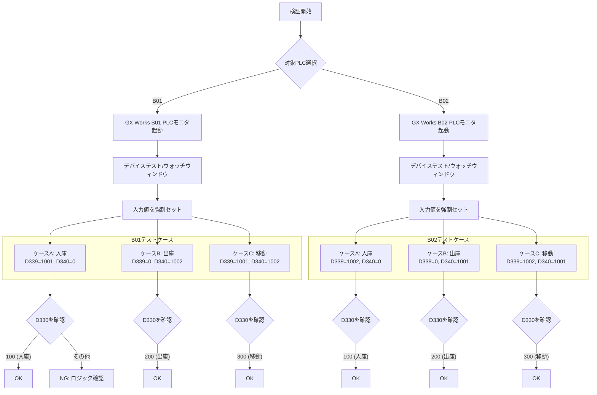
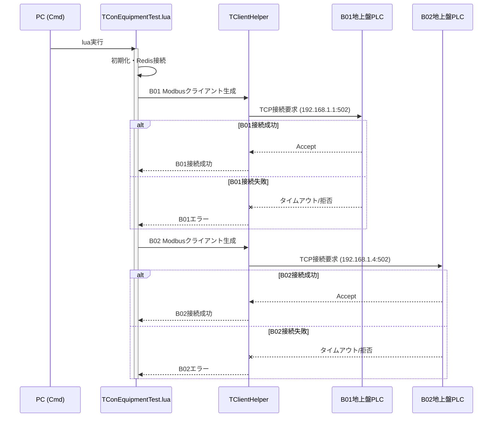
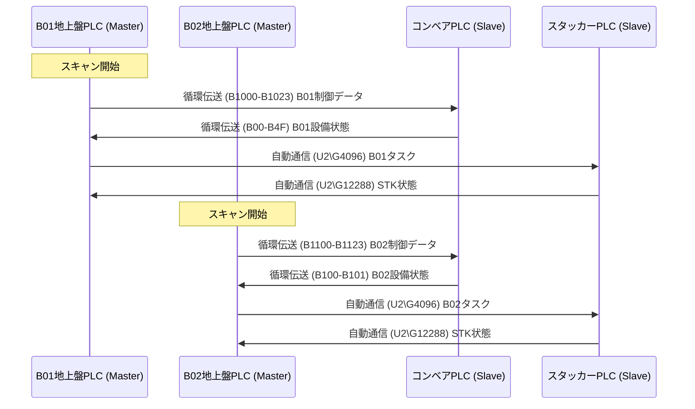
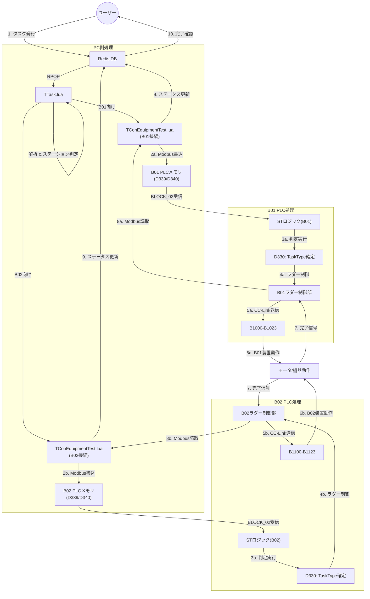

# デバッグ手順書（REFACT2版）

本手順書は、REFACT2システム（B01/B02地上盤PLCを分割した4PLC構成）の動作確認を行うためのものです。

> **REFACT2の特徴:** 地上盤PLCがB01（`B01_GroundPanel_Q_GXW.asc`）とB02（`B02_GroundPanel_Q_GXW.asc`）に分割されており、各PLCを個別にデバッグできます。

---

## 1. 準備

### 1.1 PC環境
- [ ] Windows端末にて必要なLUAスクリプト、Redisサーバーが動作していることを確認する。
- [ ] Modbus/TCP通信に必要なライブラリ（`socket`, `TClientHelper`）が使用可能であること。
- [ ] B01/B02それぞれのIPアドレスが設定されていること。

### 1.2 PLC環境
- [ ] GX Works2/3にて、`REFACT2`フォルダ内のプログラム（`.asc`, `.st`）が各PLCに書き込まれているか確認する。
  - PLC-1: `B01_GroundPanel_Q_GXW.asc` + `Masked_ST_Logic.st`
  - PLC-2: `B02_GroundPanel_Q_GXW.asc` + `Masked_ST_Logic.st`
  - PLC-3: `Conveyor_Refactored_Q_GXW.asc`
  - PLC-4: `StackerCrane_Refactored_Q_GXW.asc`
- [ ] B01/B02それぞれのCC-Linkマスターユニット設定が正しく行われていること。

### 1.3 ネットワーク
- [ ] PCとB01地上盤PLCがEthernetで接続され、Pingが通ることを確認する。
- [ ] PCとB02地上盤PLCがEthernetで接続され、Pingが通ることを確認する。
- [ ] B01地上盤PLCとコンベアPLCがCC-Linkで接続されていること（B00〜B4F受信確認）。
- [ ] B02地上盤PLCとコンベアPLCがCC-Linkで接続されていること（B100〜B101受信確認）。
- [ ] B01/B02地上盤PLCとスタッカーPLCがCC-Linkで接続されていること。

---

## 2. タスク判定ロジック (ST言語) の確認

`Masked_ST_Logic.st` がB01/B02それぞれのPLCで正しく機能するか確認します。



### 判定条件テーブル（B01/B02共通）

| ケース | 入力: D339 (Src) | 入力: D340 (Dest) | 期待値: D330 (TaskType) |
|---|---|---|---|
| A. 入庫 | 0より大 | 0 | **100** |
| B. 出庫 | 0 | 0より大 | **200** |
| C. 移動 | 0より大 | 0より大 | **300** |

---

## 3. Modbus/TCP通信確認

### 3.1 B01/B02個別接続確認



### 3.2 主な通信レジスタ（B01/B02共通）

| レジスタ | Modbusアドレス | 方向 | 確認値 |
|---------|---------------|------|--------|
| D3000 | 3000 | R | タイマー値 (T0) ハートビート |
| D3002 | 3002 | R | 設備状態フラグ |
| D3003 | 3003 | R | エラーコード |
| D339 | 339 | W | 搬入元ステーション |
| D340 | 340 | W | 搬出先ステーション |
| D400 | 400 | W | WMS指示タスクタイプ |
| D401 | 401 | W | WMS指示タスクID |

### 3.3 B01専用通信レジスタ

| レジスタ | Modbusアドレス | 方向 | 確認値 |
|---------|---------------|------|--------|
| D331〜D337 | 331〜337 | R | RFID1データ（7ワード） |
| D338〜D344 | 338〜344 | R | RFID2データ（7ワード） |
| D3287 | 3287 | R | B01タスクID1 |
| D3291 | 3291 | R | B01 AGV行き先1 |
| D4001 | 4001 | R/W | B01 ForkSTタスクID |
| D4004 | 4004 | R/W | CV1 出庫STタスクID |

### 3.4 B02専用通信レジスタ

| レジスタ | Modbusアドレス | 方向 | 確認値 |
|---------|---------------|------|--------|
| D352〜D358 | 352〜358 | R | RFID3データ（7ワード） |
| D359〜D365 | 359〜365 | R | RFID4データ（7ワード） |
| D3293 | 3293 | R | B02タスクID1 |
| D3297 | 3297 | R | B02 AGV行き先1 |
| D4049 | 4049 | R/W | B02 ForkSTタスクID |
| D4052 | 4052 | R/W | CV2 出庫STタスクID |

---

## 4. CC-Link通信確認

### 4.1 B01地上盤 CC-Link接続状態確認

| デバイス | 期待値 | 確認方法 |
|---------|--------|---------|
| SB49 | 正常コード | GX Worksモニタ（B01 PLC） |
| M370 | ON | B01_ON正常 |
| M372 | ON | AGV_ON正常 |
| W900.0 | ON | B01スレーブ接続状態 |
| W900.2 | ON | AGVスレーブ接続状態 |

### 4.2 B02地上盤 CC-Link接続状態確認

| デバイス | 期待値 | 確認方法 |
|---------|--------|---------|
| SB49 | 正常コード | GX Worksモニタ（B02 PLC） |
| M371 | ON | B02_ON正常 |
| M372 | ON | AGV_ON正常 |
| W900.1 | ON | B02スレーブ接続状態 |
| W900.2 | ON | AGVスレーブ接続状態 |

### 4.3 B01 CC-Link信号マッピング確認

**B01設備（コンベア→B01地上盤）:**

| バッファ | 内部リレー | 確認値 |
|---------|-----------|--------|
| B00 | M1000 | 電源入 |
| B01 | M1001 | 運転準備入 |
| B04 | M1004 | 非常停止正常 |
| B0A | M1010 | 自動運転中 |
| B30 | M1048 | CV1_STK受取可 |
| B40 | M1064 | CV2_STK受渡可 |

**B01設備（B01地上盤→コンベア）:**

| バッファ | 確認値 |
|---------|--------|
| B1000 | 電源入 |
| B1001 | 運転準備入 |
| B1004 | 非常停止正常 |
| B100A | 自動運転中 |
| B1010 | 自動モード選択 |

### 4.4 B02 CC-Link信号マッピング確認

**B02設備（コンベア→B02地上盤）:**

| バッファ | 内部リレー | 確認値 |
|---------|-----------|--------|
| B100 | M1200 | 電源入 |
| B101 | M1201 | 運転準備入 |

**B02設備（B02地上盤→コンベア）:**

| バッファ | 確認値 |
|---------|--------|
| B1100 | 電源入 |
| B1101 | 運転準備入 |
| B1104 | 非常停止正常 |
| B110A | 自動運転中 |
| B1110 | 自動モード選択 |

### 4.5 CC-Link通信フロー（REFACT2）



---

## 5. 統合動作確認



### 確認手順

1. **B01向けタスク投入（入庫テスト）**
   ```bash
   redis-cli LPUSH taskInfo '{"cmd":101,"task_id":12345,"src_station":1001,"dest_rack":2,"dest_col":3,"dest_row":3,"barcode":"TEST001"}'
   ```

2. **B02向けタスク投入（入庫テスト）**
   ```bash
   redis-cli LPUSH taskInfo '{"cmd":101,"task_id":12346,"src_station":1002,"dest_rack":3,"dest_col":4,"dest_row":2,"barcode":"TEST002"}'
   ```

3. **B01 Modbus受信確認**
   - B01 PLCの `D339` に `1001` が設定されることを確認
   - `D330` が `100`（入庫）に変化することを確認

4. **B02 Modbus受信確認**
   - B02 PLCの `D339` に `1002` が設定されることを確認
   - `D330` が `100`（入庫）に変化することを確認

5. **CC-Link通信確認**
   - B01: `B1000〜` の値が更新されることを確認
   - B02: `B1100〜` の値が更新されることを確認

6. **並列動作確認（REFACT2の特徴）**
   - B01とB02が同時にタスクを実行できることを確認
   - 一方が異常停止しても、他方が継続運転できることを確認

7. **完了確認**
   - Redisに完了報告が書き込まれることを確認

---

## 6. トラブルシューティング

### 6.1 Modbus/TCP関連

| 症状 | 原因 | 対処 |
|------|------|------|
| B01接続エラー | B01 IPアドレス不一致 | `TConEquipmentTest.lua`のB01 IP設定確認 |
| B02接続エラー | B02 IPアドレス不一致 | `TConEquipmentTest.lua`のB02 IP設定確認 |
| タイムアウト | PLC応答なし | 対象PLCのモード確認（RUN/STOP） |
| 読取エラー | レジスタアドレス不正 | `TModbusHelper`のアドレス確認 |

### 6.2 CC-Link関連

| 症状 | 原因 | 対処 |
|------|------|------|
| B01: M370 OFF | B01 CC-Link通信異常 | B01側CC-Linkケーブル接続確認 |
| B02: M371 OFF | B02 CC-Link通信異常 | B02側CC-Linkケーブル接続確認 |
| B01: B00〜B4F更新なし | B01スレーブ局異常 | コンベアPLC B01側ステーション設定確認 |
| B02: B100〜B101更新なし | B02スレーブ局異常 | コンベアPLC B02側ステーション設定確認 |
| RFIDデータNG（B01） | W0/W10バッファ異常 | D331〜D338のWレジスタ範囲確認 |
| RFIDデータNG（B02） | W80/W90バッファ異常 | D352〜D359のWレジスタ範囲確認 |

### 6.3 STロジック関連

| 症状 | 原因 | 対処 |
|------|------|------|
| D330が変化しない（B01） | B01の D339/D340が0 | B01へのModbus書き込み確認 |
| D330が変化しない（B02） | B02の D339/D340が0 | B02へのModbus書き込み確認 |
| 異常な値になる | STロジック未実行 | ラダースキャン順序確認 |

### 6.4 B01/B02分割特有の問題

| 症状 | 原因 | 対処 |
|------|------|------|
| B01のみ動作しない | B01 PLCプログラム未書込 | `B01_GroundPanel_Q_GXW.asc`を再書込 |
| B02のみ動作しない | B02 PLCプログラム未書込 | `B02_GroundPanel_Q_GXW.asc`を再書込 |
| B02 CC-Linkデータが少ない | B02は B100〜B101のみ受信 | 仕様通り（B02は最小限の受信） |
| B01/B02で同一デバイスが競合 | 共通デバイス（D450等）の競合 | 各PLCは独立しているため競合なし |
