# PLCプログラム 制御フロー図（REFACT2版）

各PLCプログラム（B01地上盤、B02地上盤、スタッカークレーン、コンベア）の制御ロジックを可視化したフロー図です。

> **REFACT2の特徴:** 地上盤PLCがB01とB02に分割されており、各PLCが独立したCC-Linkマスターとして動作します。

---

## 1. B01地上盤PLC (`B01_GroundPanel_Q_GXW.asc`)

### 1-1. メイン処理フロー

### 1-2. B01 CC-Link受信処理フロー（プログラム01）

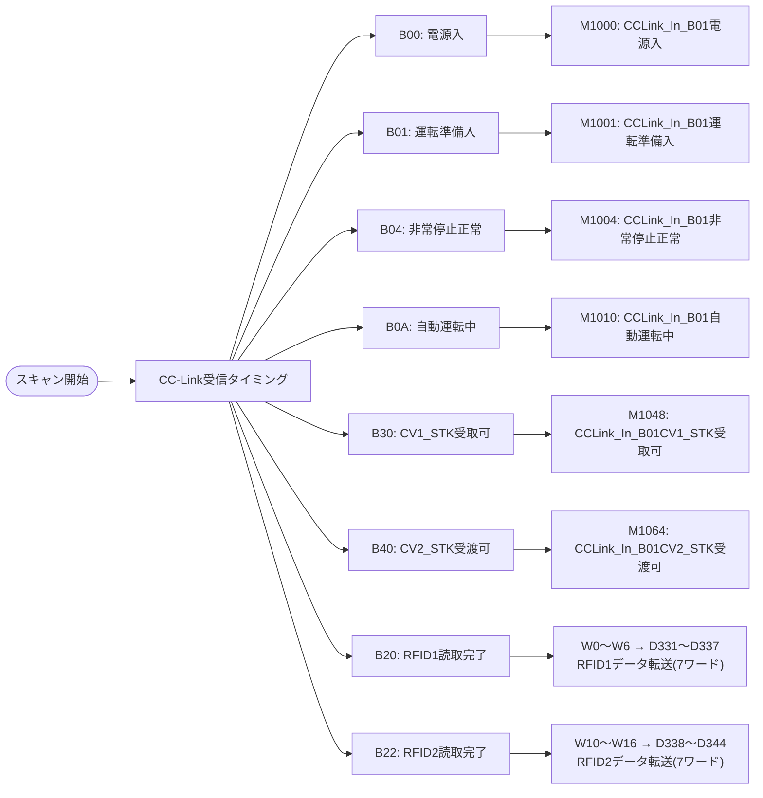

### 1-3. B01 CC-Link送信処理フロー（プログラム41）

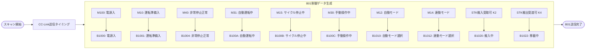

### 1-4. B01タスク管理フロー（プログラム14）

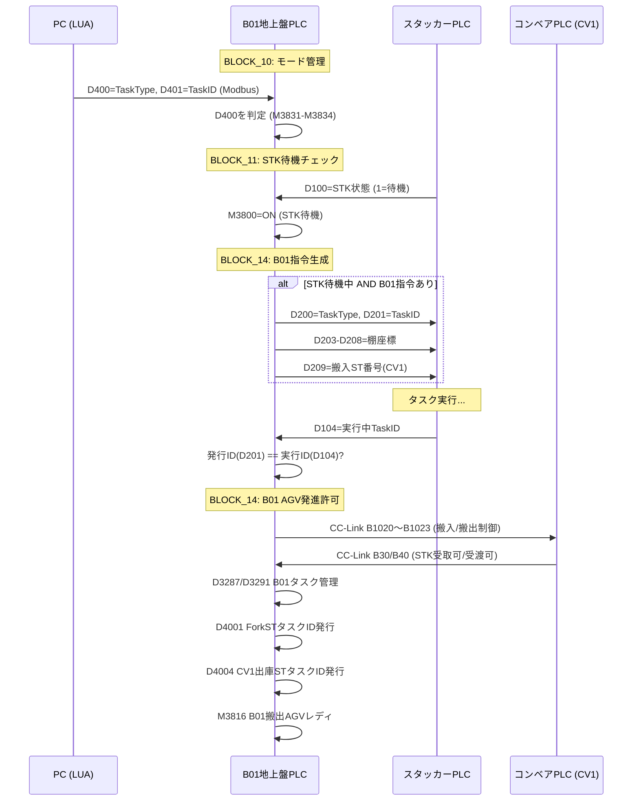

---

## 2. B02地上盤PLC (`B02_GroundPanel_Q_GXW.asc`)

### 2-1. メイン処理フロー

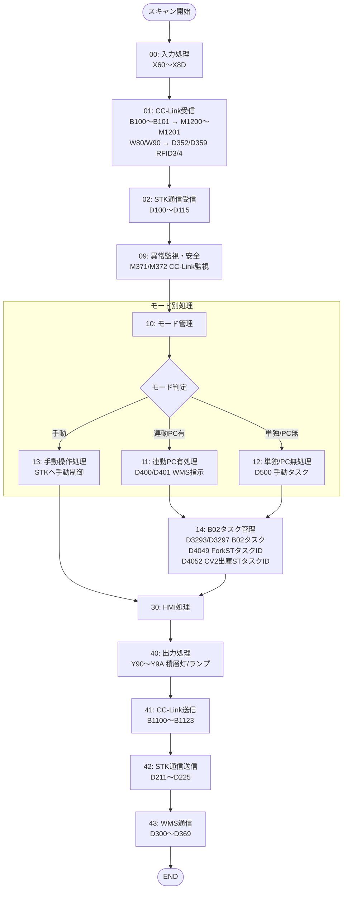

### 2-2. B02 CC-Link受信処理フロー（プログラム01）

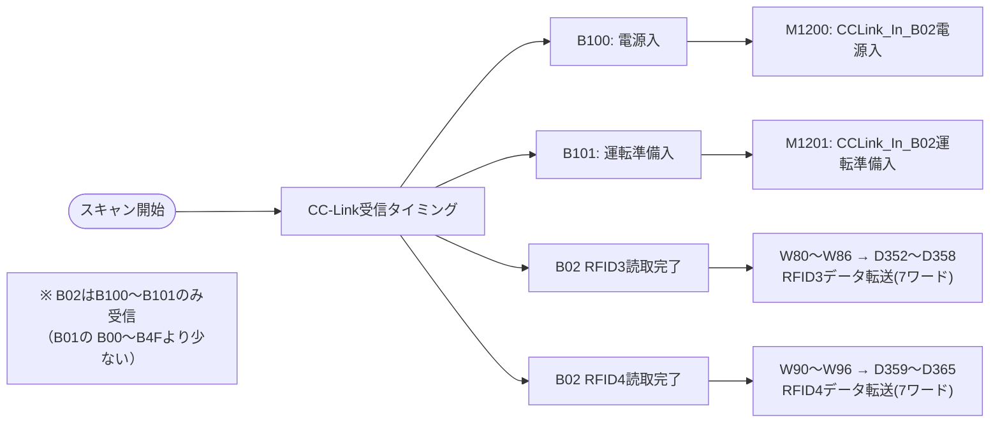

### 2-3. B02 CC-Link送信処理フロー（プログラム41）

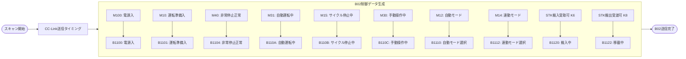

### 2-4. B02タスク管理フロー（プログラム14）

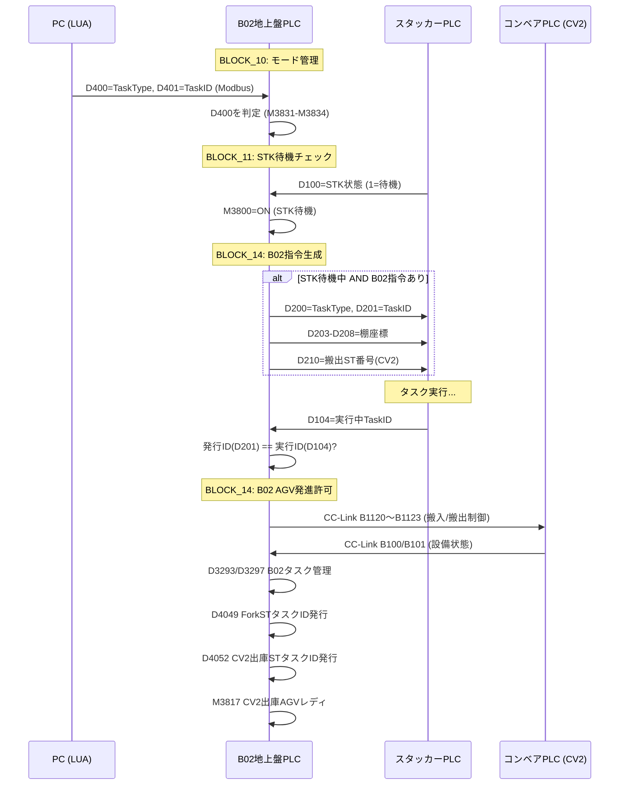

---

## 3. B01/B02共通 CC-Link通信監視フロー（プログラム09）

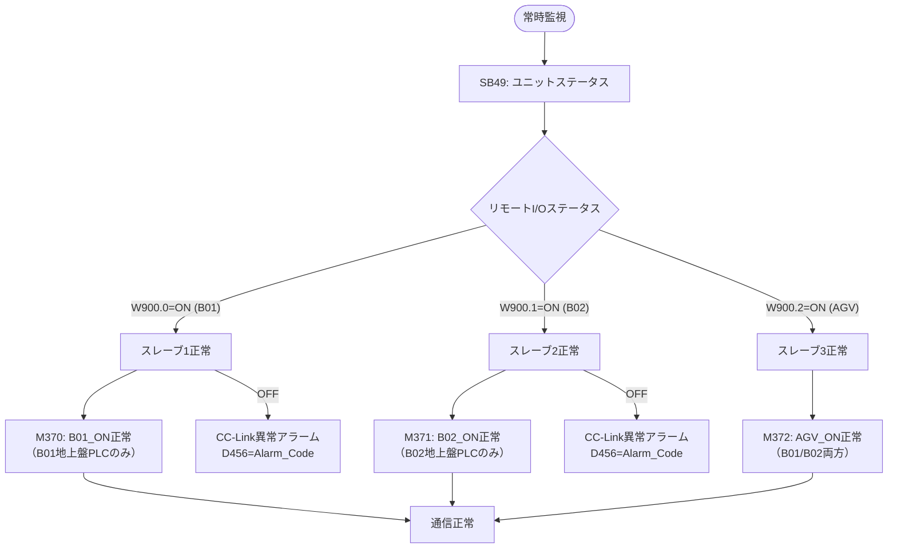

---

## 4. スタッカークレーンPLC (`StackerCrane_Refactored_Q_GXW.asc`)

> ※ REFACT2ではStackerCraneは変更なし。B01/B02両方の地上盤PLCからタスクを受信します。

### 4-1. 自動運転ステートマシン (BLOCK_07)

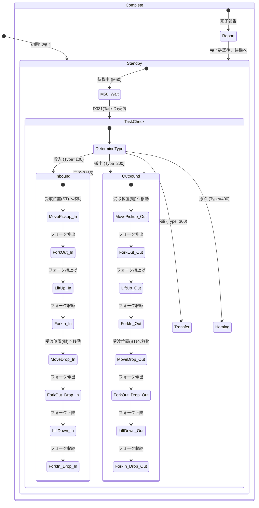

---

## 5. コンベアPLC (`Conveyor_Refactored_Q_GXW.asc`)

> ※ REFACT2ではConveyorは変更なし。B01地上盤とB02地上盤の両方からCC-Link制御を受けます。

### 5-1. CC-Link通信処理フロー（REFACT2対応）

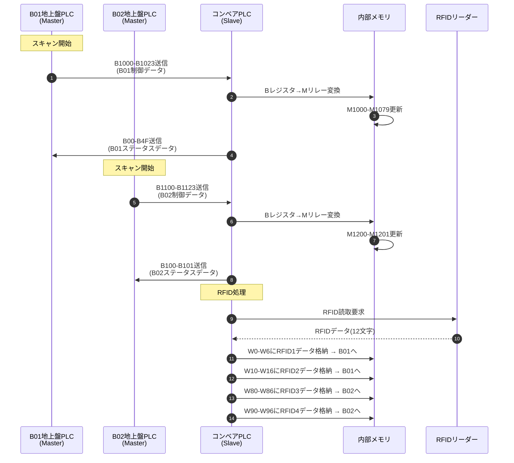

### 5-2. CC-Link信号マッピング（REFACT2）

**B01地上盤→コンベア（B01制御データ）:**

| バッファ | 内部リレー | 説明 |
|---------|-----------|------|
| B1000 | M1000 | B01電源入 |
| B1001 | M1001 | B01運転準備入 |
| B1004 | M1004 | B01非常停止正常 |
| B100A | M1010 | B01自動運転中 |
| B1010 | M1016 | B01自動モード選択 |
| B101A | M1026 | B01連動運転開始 |
| B1020 | M1032 | B01搬入中（STK搬入受取可 K2） |
| B1022 | M1034 | B01移載中（STK搬入受渡可 K4） |

**B02地上盤→コンベア（B02制御データ）:**

| バッファ | 内部リレー | 説明 |
|---------|-----------|------|
| B1100 | M1200 | B02電源入 |
| B1101 | M1201 | B02運転準備入 |
| B1104 | M1204 | B02非常停止正常 |
| B110A | M1210 | B02自動運転中 |
| B1110 | M1216 | B02自動モード選択 |
| B111A | M1226 | B02連動運転開始 |
| B1120 | M1232 | B02搬入中（STK搬入受取可 K6） |
| B1122 | M1234 | B02移載中（STK搬入受渡可 K8） |

**コンベア→B01地上盤（B01ステータスデータ）:**

| 内部リレー | バッファ | 説明 |
|-----------|---------|------|
| M1000 | B00 | 電源入 |
| M1001 | B01 | 運転準備入 |
| M1002 | B02 | 重故障 |
| M1004 | B04 | 非常停止正常 |
| M1048 | B30 | CV1_STK受取可 |
| M1049 | B31 | CV1_AGV発進可 |
| M1064 | B40 | CV2_STK受渡可 |
| M1065 | B41 | CV2_AGV発進可 |

**コンベア→B02地上盤（B02ステータスデータ）:**

| 内部リレー | バッファ | 説明 |
|-----------|---------|------|
| M1200 | B100 | B02電源入 |
| M1201 | B101 | B02運転準備入 |

---

## 6. REFACT2 全体通信フロー

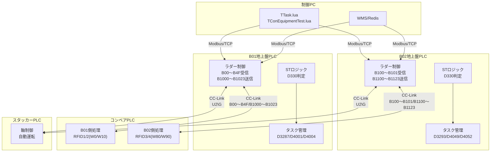
