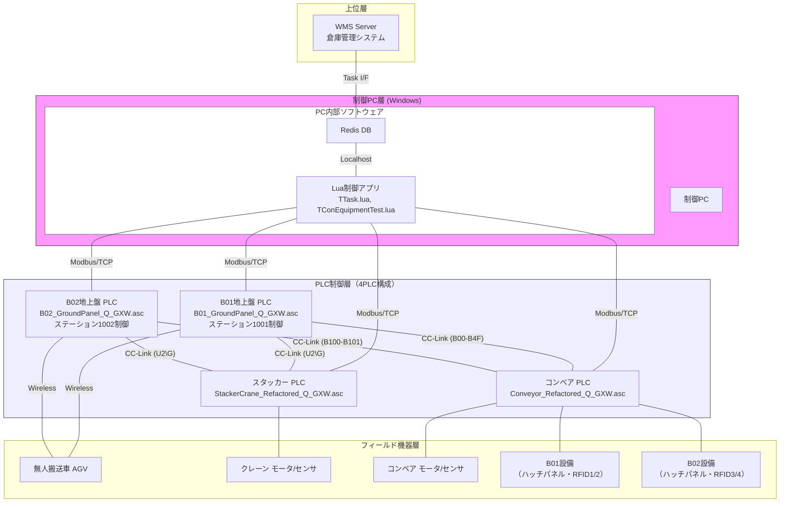
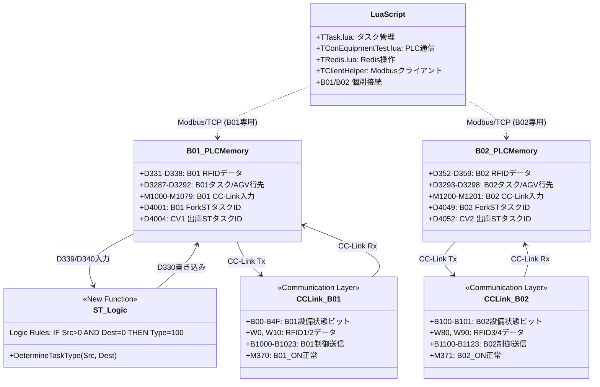
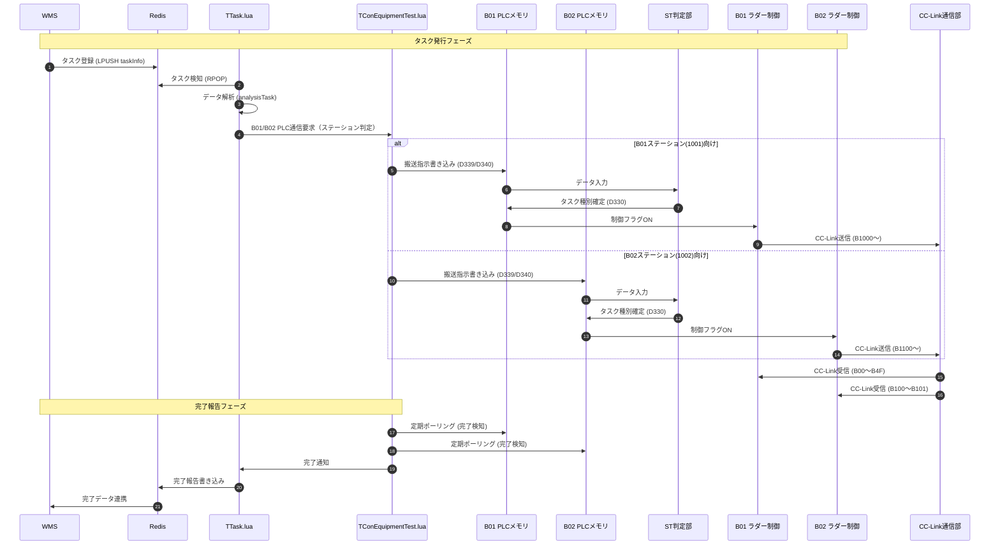

# システムアーキテクチャ・ソフトウェア構成（REFACT2版）

## 1. ハードウェア & ネットワーク構成

REFACT2では、地上盤PLCをB01/B02の2台に分割した **4PLC構成** を採用しています。

### 1.1 REFACT vs REFACT2 構成比較

| 項目 | REFACT（3PLC） | REFACT2（4PLC） |
|------|--------------|----------------|
| 地上盤 | GroundPanel（B01+B02統合） | B01_GroundPanel + B02_GroundPanel（分割） |
| コンベア | Conveyor_Refactored | Conveyor_Refactored（変更なし） |
| スタッカー | StackerCrane_Refactored | StackerCrane_Refactored（変更なし） |
| 信頼性 | 地上盤故障で全停止 | B01/B02独立運転可能 |
| 処理能力 | 1PLCで両ステーション処理 | 並列処理でスループット向上 |

### 1.2 Modbus/TCP通信詳細

PCのLuaアプリケーションとPLC間の通信はModbus/TCPプロトコルで行われます。

| 項目 | 設定値 |
|------|--------|
| プロトコル | Modbus/TCP |
| 実装ファイル | `TConEquipmentTest.lua`, `TClientHelper` |
| ポート番号 | 502 (デフォルト) |
| 通信機能 | レジスタ読み書き、接続監視 |

**接続先一覧（REFACT2）:**

| PLC | IPアドレス（例） | ポート | 用途 |
|-----|----------------|--------|------|
| B01地上盤 PLC | 192.168.1.1 | 502 | B01タスク指示、ステータス監視 |
| B02地上盤 PLC | 192.168.1.4 | 502 | B02タスク指示、ステータス監視 |
| スタッカー PLC | 192.168.1.2 | 502 | 走行/昇降/フォーク制御 |
| コンベア PLC | 192.168.1.3 | 502 | 搬入/搬出制御 |

### 1.3 CC-Link通信詳細

B01地上盤PLCとB02地上盤PLCがそれぞれ独立したCC-Linkマスターとして動作します。

| 項目 | B01地上盤 | B02地上盤 |
|------|----------|----------|
| 役割 | CC-Linkマスター | CC-Linkマスター |
| 受信バッファ | B00〜B4F（M1000〜M1079） | B100〜B101（M1200〜M1201） |
| 送信バッファ | B1000〜B1023 | B1100〜B1123 |
| RFIDデータ | W0/W10 → D331/D338（RFID1/2） | W80/W90 → D352/D359（RFID3/4） |
| STK通信 | U2\G4096（受信）/ U2\G12288（送信） | U2\G4096（受信）/ U2\G12288（送信） |

---

## 2. ソフトウェアモジュール関連図

---

## 3. 詳細ワークフロー (シーケンス)

---

## 4. プログラムファイル構成

### 4.1 PLCプログラムファイル（REFACT2）

| ファイル名 | PLC | 役割 | 主な機能 |
|-----------|-----|------|---------|
| `B01_GroundPanel_Q_GXW.asc` | PLC-1 | B01地上盤 | CC-Link B00〜B4F受信、RFID1/2、B01タスク管理、B1000〜送信 |
| `B02_GroundPanel_Q_GXW.asc` | PLC-2 | B02地上盤 | CC-Link B100〜B101受信、RFID3/4、B02タスク管理、B1100〜送信 |
| `Conveyor_Refactored_Q_GXW.asc` | PLC-3 | コンベア | CC-Link通信、RFID処理、AGV連携 |
| `StackerCrane_Refactored_Q_GXW.asc` | PLC-4 | スタッカークレーン | 軸制御、自動運転、安全監視 |
| `Masked_ST_Logic.st` | PLC-1/2共通 | STロジック（タスク判定） | D339/D340からD330を判定 |

### 4.2 Luaプログラムファイル

| ファイル名 | 役割 | 主な機能 |
|-----------|------|---------| 
| `TTask.lua` | タスク管理メタクラス | WMSからのタスク受信、解析、Redis連携、B01/B02振り分け |
| `TConEquipmentTest.lua` | PLC通信クラス | Modbus/TCP通信、B01/B02個別接続管理 |
| `TRedis.lua` | Redis操作クラス | hmget/hmset、lpush/rpop、接続プール管理 |

---

## 5. CC-Link通信仕様（REFACT2）

### 5.1 B01地上盤 CC-Link信号マッピング

| 方向 | バッファ | 内容 |
|------|---------|------|
| Rx（コンベア→B01） | B00〜B4F | B01設備状態ビット（電源、運転準備、RFID、CV1/CV2状態） |
| Rx（コンベア→B01） | W0/W10 | RFID1/2データ（各7ワード） |
| Tx（B01→コンベア） | B1000〜B1023 | B01制御データ（運転許可、モード、タスク） |
| STK通信 | U2\G4096/12288 | スタッカーとのデータ送受信 |

### 5.2 B02地上盤 CC-Link信号マッピング

| 方向 | バッファ | 内容 |
|------|---------|------|
| Rx（コンベア→B02） | B100〜B101 | B02設備状態ビット（電源、運転準備） |
| Rx（コンベア→B02） | W80/W90 | RFID3/4データ（各7ワード） |
| Tx（B02→コンベア） | B1100〜B1123 | B02制御データ（運転許可、モード、タスク） |
| STK通信 | U2\G4096/12288 | スタッカーとのデータ送受信 |

### 5.3 通信監視デバイス

| デバイス | 内容 | B01ファイル | B02ファイル |
|---------|------|------------|------------|
| M370 | B01_ON正常（SB49 AND W900.0） | ✅ 使用 | — |
| M371 | B02_ON正常（SB49 AND W900.1） | — | ✅ 使用 |
| M372 | AGV_ON正常（SB49 AND W900.2） | ✅ 使用 | ✅ 使用 |
