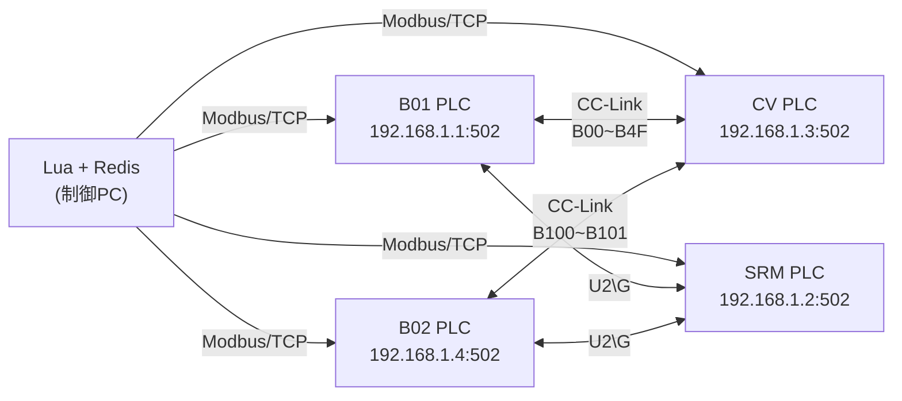
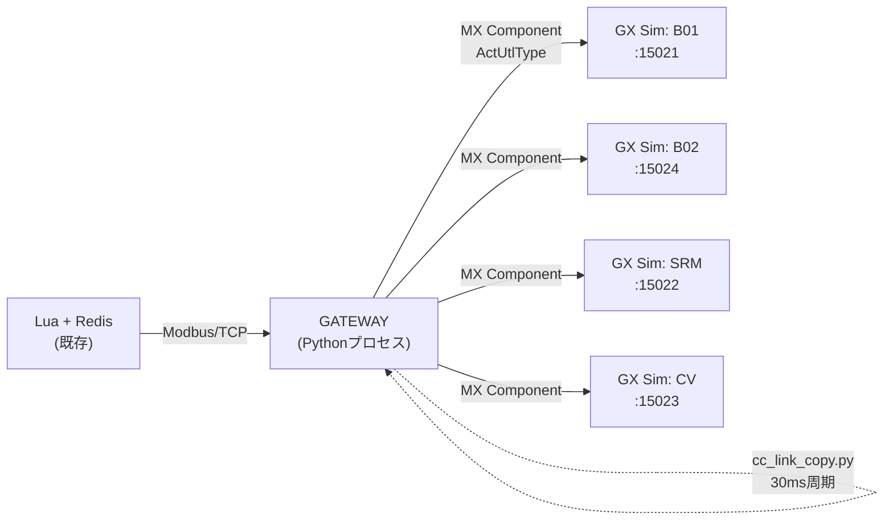

# GATEWAY + GX Works2 オフライン検証 実現性レポート

## 結論：**条件付きで実現可能（ただしギャップあり）**

現在のGATEWAYコード一式とGX Works2 / GX Simulator2を併用することで、REFACT3のASCラダー回路・REFACT2のSTロジック・Luaファイルの**主要な機能確認は可能**です。ただし、いくつかのギャップが存在するため、全シーケンスを完全に自動で流すには追加対応が必要です。

---

## 1. 全体構成の整合性

### 1.1 実機構成（参考）



### 1.2 GATEWAY構成（1PC内で再現）



> [!IMPORTANT]
> GATEWAYが「Modbus ↔ MX Component変換」と「CC-Link仮想コピー」の**両方を1プロセスで担当**する設計です。

---

## 2. 検証可能な項目 ✅

| # | 検証対象 | 仕組み | 判定 |
|---|---------|--------|------|
| 1 | **STロジック（D339/D340 → D330）** | Lua→Modbus→GATEWAY→MX→GX Sim上B01/B02のSTブロックが実行→D330生成 | ✅ 完全対応 |
| 2 | **M8001オフラインバイパス** | GATEWAY起動時にM8001をONに設定。ASC内のバイパス回路（物理I/O・CC-Link異常の無視）が機能 | ✅ 完全対応 |
| 3 | **ハンドシェイク D212/D214** | B01のプログラム42でM1000, M1004（搬入）/ M1048, M1052（搬出）の条件からD212, D214を出力→GATEWAYがSRMへコピー | ✅ 対応 |
| 4 | **SRM側でのタスクデータ受信** | `cc_link_copy.py`がB01:D330→SRM:D330, B01:D212→SRM:D212等をコピー | ✅ 対応 |
| 5 | **Luaのタスク生成→Redis→PLC書込の結合テスト** | TTask.luaがRedisからタスクを取得、Modbusで書込み。接続先をlocalhost:15021等に変更すればGATEWAYを経由してGX Simに接続可能 | ✅ 対応 |
| 6 | **完了通知の逆コピー（SRM→B01/B02）** | SRM:D520→B01:D520, SRM:D521→B02:D521 をcc_link_copyで定義済み | ✅ 対応 |

---

## 3. ギャップと問題点 ⚠️

### 3.1 CC-Link コピー対象が不足

> [!WARNING]
> 現在のGATEWAYのcc_link_copyルールは**Dレジスタのみ10点**ですが、実際のラダー回路はBデバイス（ビットデバイス）とU2\Gバッファメモリも大量に使用しています。

**実際にASCから読み取れた通信経路：**

| 通信 | 使用デバイス | 現状のGATEWAY | 不足 |
|------|-------------|---------------|------|
| CV→B01 (CC-Link受信) | **B00~B4F** → M1000~M1079 (約80ビット) | ❌ 非対応 | Bデバイスコピーが必要 |
| CV→B02 (CC-Link受信) | **B100~B101, B1200~B1205** 等 | ❌ 非対応 | 同上 |
| B01→SRM (地上盤通信) | **U2\G4096~** ブロック一括送信 (D3000~D3030) | ❌ 非対応 | U2\G空間のコピーが必要 |
| B01→CV (CC-Link送信) | **B1000~B1023** | ❌ 非対応 | 同上 |

**影響:** 
- M8001=ONの場合、B00~B4F等のCC-Link入力は内部で「強制ON」されるためバイパス可能。しかし一部のデバイス（B39/B49等の在席センサ）は**M8001で強制ONされない**（929~943行目参照：D212の判定にM1000, M1004を使用）。
- これらのMデバイスはBデバイスから転写されるが、Bデバイス自体がGX Sim上でデフォルト0なので、**ハンドシェイク条件が成立しない可能性がある**。

### 3.2 スタッカーPLCのU2\G通信

```
; 【02-03】地上盤通信データ受信 - 統合版
; --- 360 ---
  LD SM400
  ANI M8001                ; オフライン時は地上盤受信スキップ
  BMOV U2\G4096 D3000 K30  ; 地上盤データ一括受信
```

SRMのプログラムは `U2\G4096` から30ワード一括でD3000~D3029に受信しています。M8001=ONのときはこの受信自体をスキップしますが、**タスクデータ（D330等）が入ってこない**ことになります。

> [!CAUTION]
> **M8001=ON時にSRMがタスクを受け取れない問題**があります。GATEWAYのcc_link_copyでD330→SRM:D330にコピーしても、SRM側ではD3000を経由して内部のD330へ代入しているため、直接D330に書いても効果がありません。

### 3.3 Modbusマッピングのアドレス問題

現在の `config.json` のマッピング：
```json
"400339": "D339"  → offset計算: 400339 - 400000 = 339
```

Luaの `TConEquipmentTest.lua` が実際にどのModbusアドレスで書き込んでいるかを確認する必要があります。Lua側のWrite先アドレスが「0-based 339番」なのか「40339」なのかでズレが生じます。

### 3.4 コンベアPLCのシミュレーション

コンベアPLC (`Conveyor_Refactored_Q_Switch_GXW.asc`) はM8001=ON時に内部タイマーで搬送完了をシミュレートしますが、**CVの完了信号をB01のBデバイス（B39, B3F, B49, B4F等）に書き戻す仕組み**がGATEWAYにありません。CV→B01のCC-Linkコピーが不足しているためです。

---

## 4. 対策・改修案

### 4.1 cc_link_copyの拡張（Bデバイス・U2\G対応）

```json
{
  "cclink_copy": {
    "interval_ms": 30,
    "rules": [
      // 既存のDレジスタルール
      {"src": "B01:D330", "dst": "SRM:D330"},
      // ...（現行ルール維持）...

      // 【追加】CV → B01 ビットデバイスコピー（在席・リフタ状態）
      {"src": "CV:B39",  "dst": "B01:B39"},
      {"src": "CV:B3F",  "dst": "B01:B3F"},
      {"src": "CV:B49",  "dst": "B01:B49"},
      {"src": "CV:B4F",  "dst": "B01:B4F"},
      {"src": "CV:B30",  "dst": "B01:B30"},
      {"src": "CV:B40",  "dst": "B01:B40"},

      // 【追加】B01 → SRM U2\G一括コピーの代替
      // 地上盤→STK通信（D200~D225をU2\Gに書込む）
      {"src": "B01:D200", "dst": "SRM:D3000"},
      {"src": "B01:D201", "dst": "SRM:D3001"},
      // ... D225まで ...

      // 【追加】B01 → CV CC-Link送信
      {"src": "B01:B1000", "dst": "CV:B1000"},
      // ...
    ]
  }
}
```

### 4.2 plc_access_mx.py のBデバイス対応

現在の `read_device` / `write_device` はDレジスタを前提としていますが、Bデバイス（ビット）にも対応させる必要があります。MX ComponentのGetDevice/SetDeviceは `"B39"` のようなデバイス名文字列をそのまま受け付けるので、コード変更は最小限です。

### 4.3 SIM_MODEデバイスの修正

`config.json` では `M8001` を設定済みですが、`gateway_spec.md` の仕様では `M100` としている箇所もあります。REFACT3の実コードは一貫して **M8001** を使っているため、現在の設定（M8001）が正しいです。

---

## 5. 検証可否の最終判定

| レベル | 内容 | 判定 |
|--------|------|------|
| **Level 1: STロジック単体** | D339/D340書込→D330自動判定 | ✅ **今すぐ可能** |
| **Level 2: ハンドシェイク単体** | GX Worksのデバイステストで条件を手動SET→D212/D214確認 | ✅ **今すぐ可能**（GATEWAYなしでもGX上で可） |
| **Level 3: 2PLC間連動** | B01→SRMのタスク伝達・完了通知 | ⚠️ **U2\Gコピーの追加が必要** |
| **Level 4: CV含む4PLC連動** | CV→B01のBデバイスコピー含む全フロー | ⚠️ **Bデバイスコピーの追加が必要** |
| **Level 5: Lua結合テスト** | TTask.lua → Redis → Modbus → GATEWAY → GX Sim → 全PLC連動 | ⚠️ **上記 + Luaの接続先変更が必要** |

---

## 6. 推奨次のアクション

1. **cc_link_copy.pyの拡張** — Bデバイスとブロックコピー（D200~D225 → D3000~D3025）に対応
2. **plc_access_mx.pyのデバイス種別対応確認** — B, M, W, U2\Gデバイスの読み書き
3. **Lua接続先の変更手順書作成** — TConEquipmentTest.lua内のIP:Portを localhost:1502x に変更
4. **GX Simulator2の4プロジェクト同時起動手順書** — 局番設定、MX ComponentのActLogicalStationNumber設定

