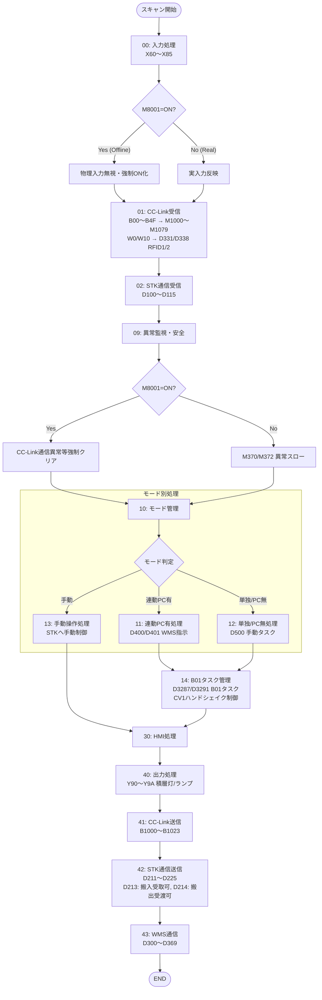
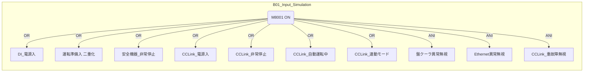
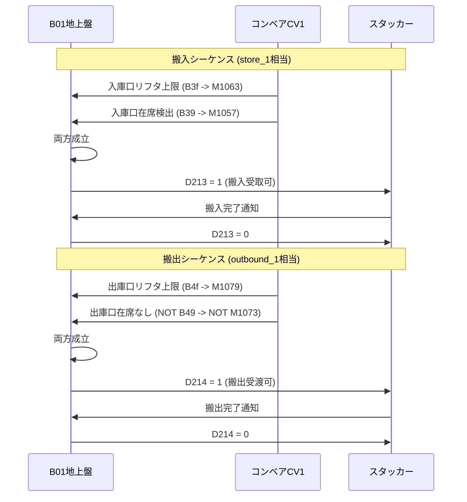
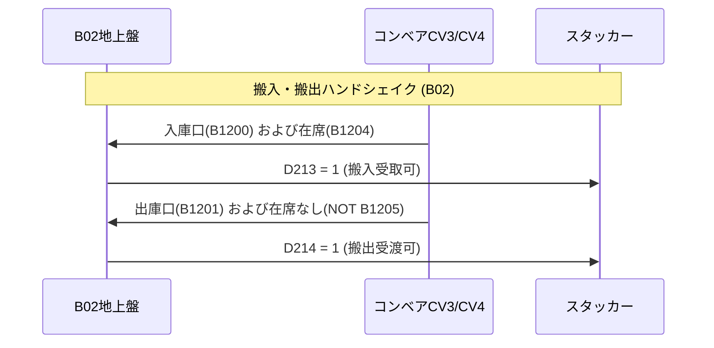
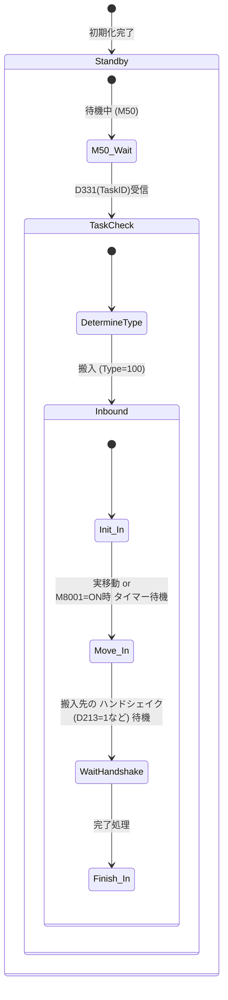

# PLCプログラム 制御フロー図（REFACT3版）

各PLCプログラム（B01地上盤、B02地上盤、スタッカークレーン、コンベア）の制御ロジックを可視化したフロー図です。

> **REFACT3の特徴:** 
> - REFACT2の4PLC構成をベースとし、全PLCにM8001（シミュレーション/実装モード切替）機能が追加されています。
> - B01/B02地上盤PLCに、コンベアとの搬入・搬出ハンドシェイク機能（Store_1/Outbound_1相当）が完全実装されました。

---

## 1. B01地上盤PLC (`B01_GroundPanel_Q_Switch_GXW.asc`)

### 1-1. メイン処理フロー



### 1-2. M8001（シミュレーション）における信号バイパス詳細



### 1-3. 新規実装: 搬入・搬出ハンドシェイク (Block 42)



---

## 2. B02地上盤PLC (`B02_GroundPanel_Q_Switch_GXW.asc`)

B02側の処理フローは基本的にB01と同様ですが、監視対象のCC-Linkデバイス範囲が限られています (B100~B101)。
また、搬入・搬出ハンドシェイクロジックは B02 独自のアドレスを使用します。



---

## 3. コンベアPLC (`Conveyor_Refactored_Q_Switch_GXW.asc`)

```mermaid
flowchart TD
    Start([スキャン開始]) --> BlockA[実入力 / シミュレーション分岐]
    BlockA --> BlockB{M8001=ON?}
    
    BlockB -- 実装モード --> BlockReal[物理センサ入力受付]
    BlockB -- シミュレーション --> BlockSim[内部タイマーによる<br/>搬送シミュレーション]
    
    BlockReal --> BlockCtrl
    BlockSim --> BlockCtrl[CC-Link制御データに基づくモータ制御]
    
    BlockCtrl --> RFID[RFIDデータ読み取り (実機 or ダミー)]
    RFID --> Send[B01(B00~B4F) / B02(B100~B101) へ送信]
    Send --> End([END])
```

---

## 4. スタッカークレーンPLC (`StackerCrane_Refactored_Q_Switch_GXW.asc`)


*(シミュレーション時は、X軸・Y軸・Z軸（フォーク）の物理インバータ起動をスキップし、タイムアウトや位置決め完了フラグを内部的に強制ONして遷移させます)*
