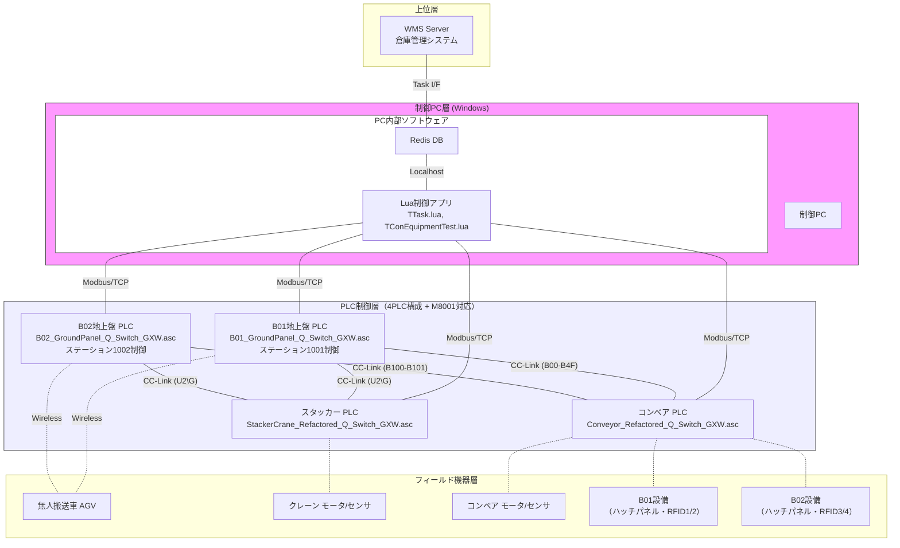
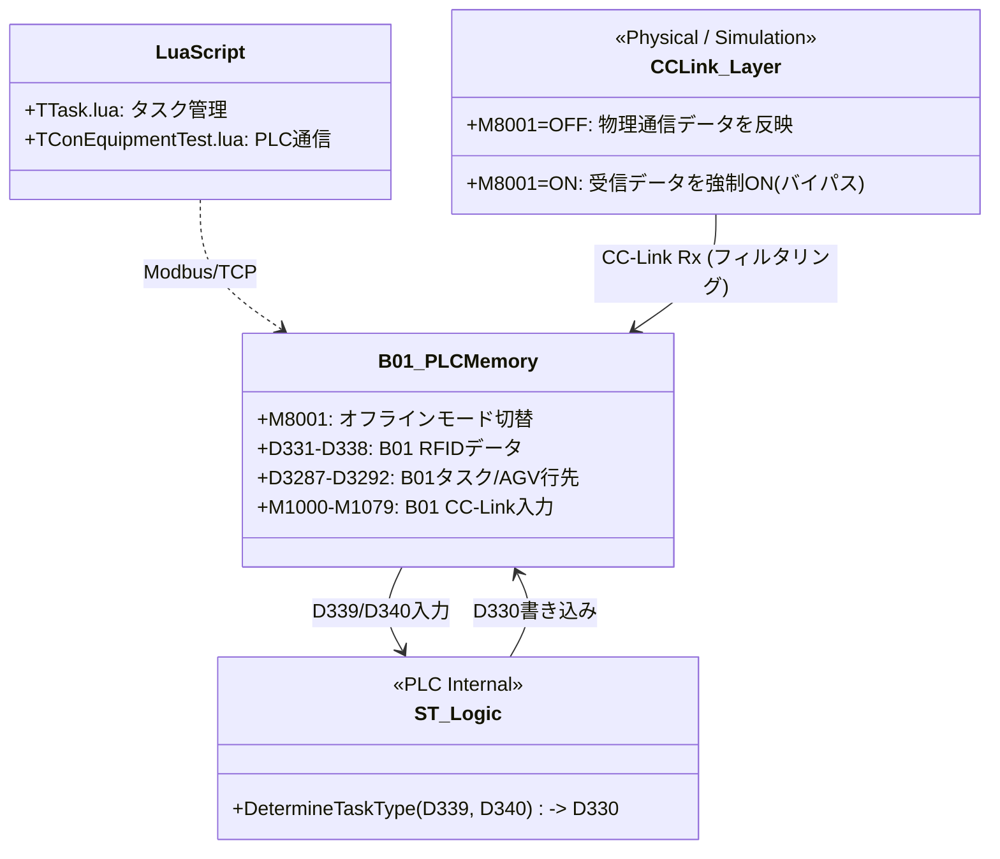
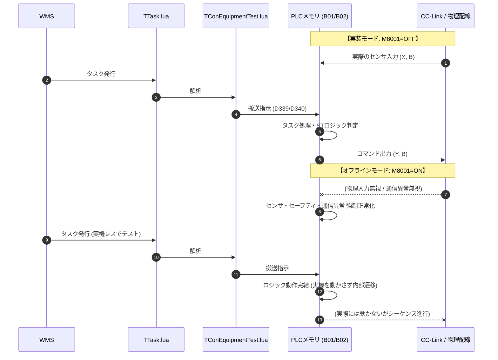

# システムアーキテクチャ・ソフトウェア構成（REFACT3版）

## 1. ハードウェア & ネットワーク構成

REFACT3では、地上盤PLCをB01/B02の2台に分割した **4PLC構成** を踏襲しつつ、**M8001（シミュレーション/実装モード切り替えフラグ）**を活用したオフラインデバッグ機能を全PLCに組み込んでいます。

*(注: `---` は実機接続、`-.-` はM8001=ON時に論理的に切り離される（バイパス/ダミー化される）物理接続を示します)*

### 1.1 REFACT2 vs REFACT3 構成比較

| 項目 | REFACT2（4PLC） | REFACT3（4PLC + シミュレーション対応） |
|------|----------------|-------------------------------------|
| I/O処理 | 物理入力に直結 | `M8001` により物理入力のバイパス・論理完結が可能 |
| CC-Link異常 | 異常検知で即停止 | `M8001=ON` で通信異常をマスキング（正常扱い） |
| ファイル名 | `..._Q_GXW.asc` | `..._Q_Switch_GXW.asc` |
| ハンドシェイク | B01/B02の一部ロジック欠落 | `Store_1`, `Outbound_1` 相当のハンドシェイク機能をPLCに完全実装 |

### 1.2 Modbus/TCP通信詳細

PCのLuaアプリケーションとPLC間の通信はModbus/TCPプロトコルで行われます。（REFACT2から変更なし）

| B01 | B02 | スタッカー | コンベア |
|---|---|---|---|
| 192.168.1.1:502 | 192.168.1.4:502 | 192.168.1.2:502 | 192.168.1.3:502 |

### 1.3 CC-Link通信詳細

B01とB02が独立したCC-Linkマスターとして動作し、M8001=ONのオフライン時は通信異常監視（M370~M372）がバイパスされます。

---

## 2. ソフトウェアモジュール関連図 (REFACT3)

---

## 3. 詳細ワークフロー (シミュレーション対応シーケンス)

## 4. プログラムファイル構成 (REFACT3)

| ファイル名 | PLC | 主な機能（REFACT3の特長） |
|-----------|-----|-------------------------|
| `B01_GroundPanel_Q_Switch_GXW.asc` | PLC-1 | M8001によるI/Oバイパス、搬入・搬出ハンドシェイク実装済 |
| `B02_GroundPanel_Q_Switch_GXW.asc` | PLC-2 | M8001によるI/Oバイパス、搬入・搬出ハンドシェイク実装済 |
| `Conveyor_Refactored_Q_Switch_GXW.asc` | PLC-3 | M8001によるコンベヤモータ動作シミュレーション、センサ無視 |
| `StackerCrane_Refactored_Q_Switch_GXW.asc` | PLC-4 | 軸移動時間の内部タイマー代替（M8001=ON時）、位置決め完了擬似生成 |
| `Masked_ST_Logic.st` | PLC-1/2 | Lua側でマスクされたタスク生成ロジックのPLC側実装 |
