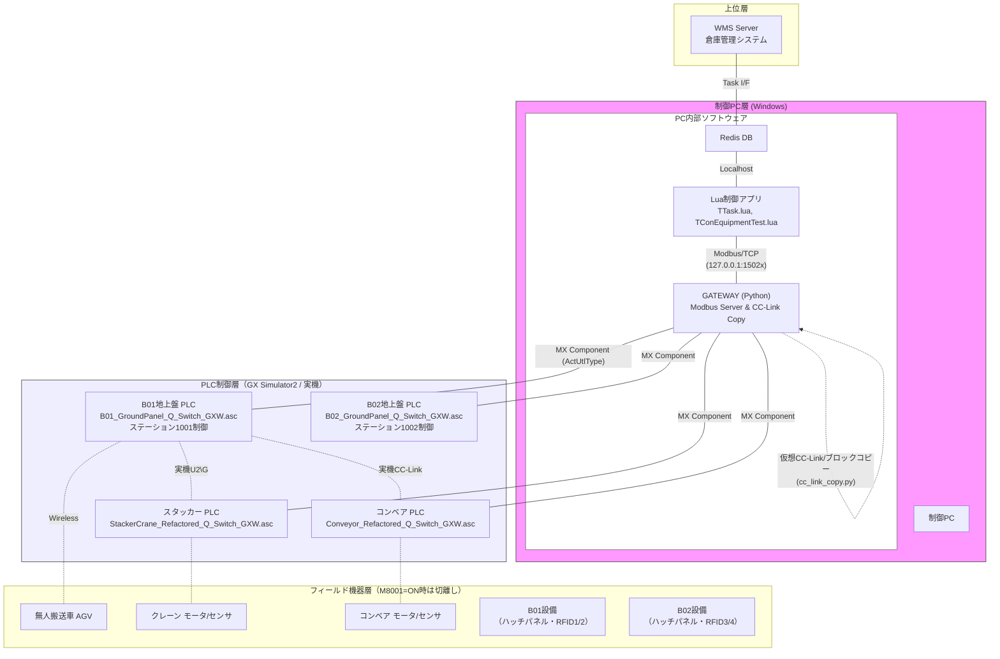
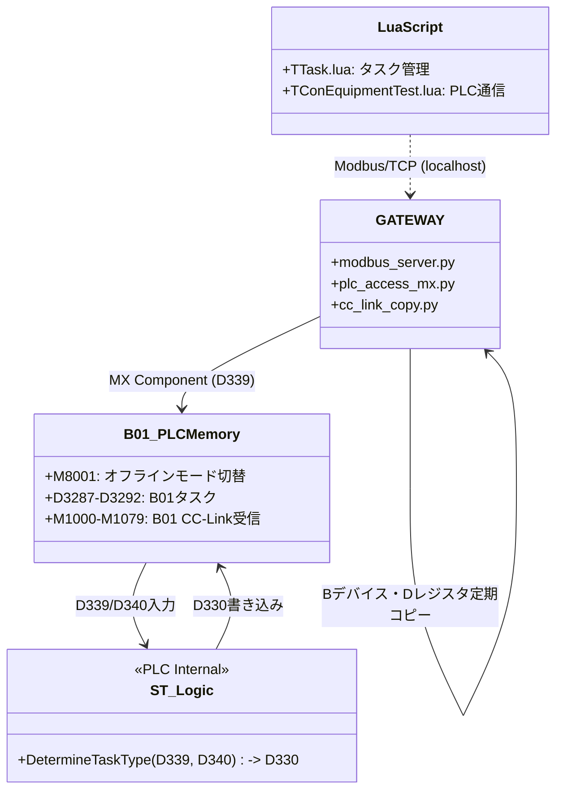
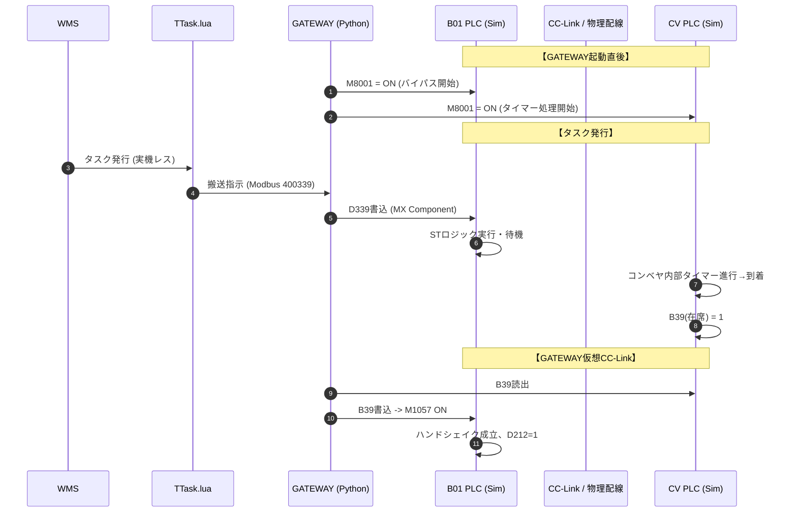

# システムアーキテクチャ・ソフトウェア構成（REFACT3 + GATEWAY版）

## 1. ハードウェア & ネットワーク構成

REFACT3では、地上盤PLCをB01/B02の2台に分割した **4PLC構成** を踏襲しつつ、**M8001（シミュレーション/実装モード切り替えフラグ）**を活用したオフラインデバッグ機能を実装しました。
さらに、PC単体でのテストを容易にするため、ModbusルーティングとCC-Link仮想コピーを統合した**GATEWAYプロセス**を追加しています。

*(注: `-.-` はM8001=ON時に論理的に切り離されるか、またはGATEWAY経由で仮想化される接続を示します)*

### 1.1 REFACT2 vs REFACT3 構成比較

| 項目 | REFACT2（実機前提） | REFACT3 + GATEWAY（シミュレーション対応） |
|------|----------------|-------------------------------------|
| I/O処理 | 物理入力に直結 | `M8001` により物理入力のバイパス・論理完結が可能 |
| PLC間通信 | CC-Linkケーブル必須 | **GATEWAY** がPC内でデバイス値を30ms周期でコピー（仮想CC-Link） |
| 接続先 | 各PLCの独自IP | Lua側からはGATEWAYのローカルポート(`15021~`)へModbus接続 |
| ハンドシェイク | Lua依存部分あり | `Store_1`, `Outbound_1` 相当のハンドシェイク機能をPLCに完全実装 |

### 1.2 通信レイヤ詳細（オフライン時）

オフライン検証時、PC上の各ソフトウェアは以下の役割を担います。

1. **Luaアプリケーション**: `127.0.0.1` 宛にModbus/TCPコマンドを送信（タスク情報の書き込み等）。
2. **GATEWAY (Modbus Server)**: 受信したModbusアドレス（例: 400339）を自動解析して対応するPLCの論理局番へ、**MX Component** を使ってデバイス値（`D339` 等）として直接書き込み・読み出しを行います。
3. **GATEWAY (CC-Link Copy)**: B01のDレジスタ（タスクデータ）、Bデバイス（コンベヤ在席フラグ）、U2\Gデータ等を定期的に読み取り、接続先のPLCデバイスへ上書きします。

これにより通信異常監視（M370~M372等）はPLC内でバイパスされつつ、値の授受自体はGATEWAYが行うため完璧な連動テストが成立します。

---

## 2. ソフトウェアモジュール関連図 (REFACT3)

---

## 3. 詳細ワークフロー (オフライン連動シーケンス)

## 4. プログラムファイル構成 (REFACT3)

| ファイル名 | 分類 | 主な機能 |
|-----------|-----|---------|
| `B01_GroundPanel_Q_Switch_GXW.asc` | PLC-1 | M8001によるI/Oバイパス、搬入・搬出ハンドシェイク実装済 |
| `B02_GroundPanel_Q_Switch_GXW.asc` | PLC-2 | M8001によるI/Oバイパス、搬入・搬出ハンドシェイク実装済 |
| `Conveyor_Refactored_Q_Switch_GXW.asc` | PLC-3 | M8001によるコンベヤモータ動作シミュレーション、センサ無視 |
| `StackerCrane_Refactored_Q_Switch_GXW.asc` | PLC-4 | 軸移動時間の内部タイマー代替（M8001=ON時）、位置決め完了擬似生成 |
| `Masked_ST_Logic.st` | PLC-1/2 | Lua側でマスクされたタスク生成ロジックのPLC側実装 |
| `GATEWAY/main.py` | PCツール | MX Component接続制御、M8001初期化 |
| `GATEWAY/modbus_server.py`| PCツール | Lua通信用ローカルModbusサーバー (Port 15021~) |
| `GATEWAY/cc_link_copy.py` | PCツール | 4つのPLCシミュレータ間でデバイス値（D, B, U2\G等）を定期コピー |
