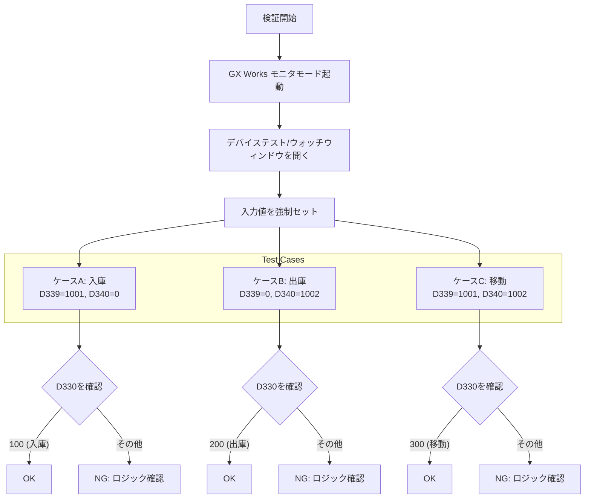
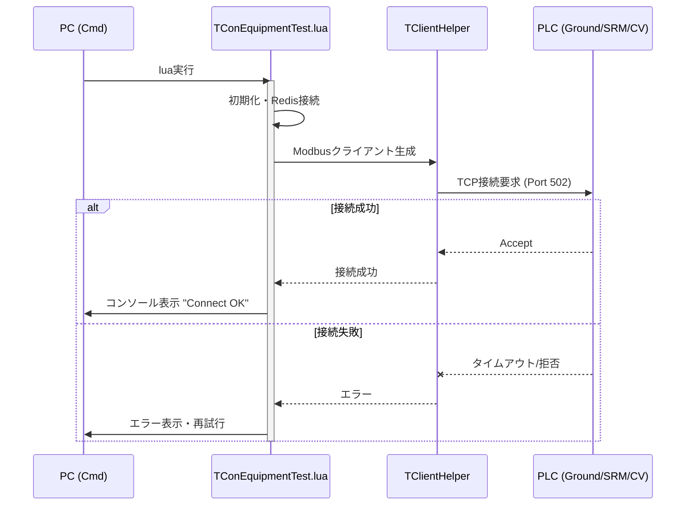
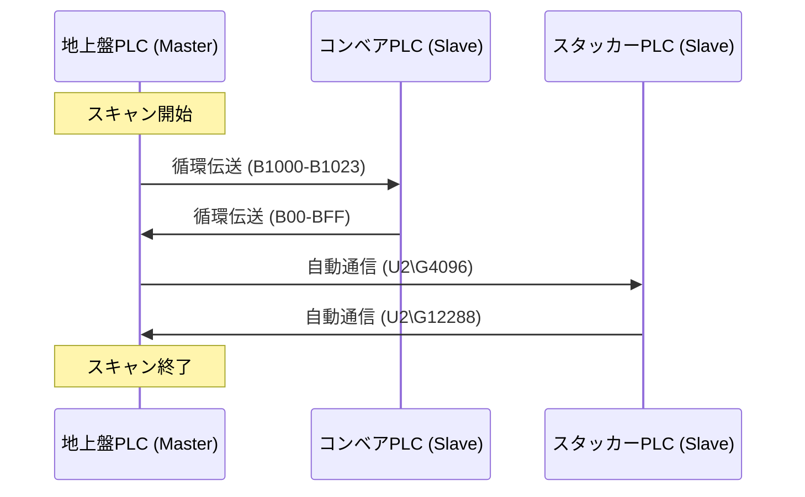
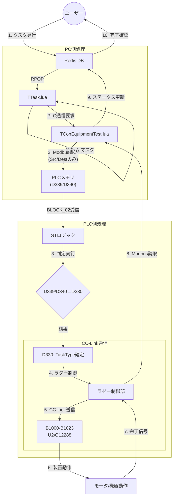

# デバッグ手順書

本手順書は、リファクタリングされたシステム（特にPLC側のSTロジック導入部分）の動作確認を行うためのものです。

## 1. 準備

### 1.1 PC環境
- [ ] Windows端末にて必要なLUAスクリプト、Redisサーバーが動作していることを確認する。
- [ ] Modbus/TCP通信に必要なライブラリ（`socket`, `TClientHelper`）が使用可能であること。

### 1.2 PLC環境
- [ ] GX Works2/3にて、`refact`フォルダ内のプログラム (`.asc`, `.st`) がPLCに書き込まれているか（シミュレータ含む）確認する。
- [ ] CC-Linkマスターユニットの設定が正しく行われていること。

### 1.3 ネットワーク
- [ ] PCとPLCがEthernetで接続され、Pingが通ることを確認する。
- [ ] 各PLCがCC-Linkで正しく接続されていることを確認する。

## 2. タスク判定ロジック (ST言語) の確認
今回新たに追加された `Masked_ST_Logic.st` が正しく機能し、PCからの指示（TaskTypeなし）を補完できるか確認します。
以下に検証フローを示します。



### 判定条件テーブル
| ケース | 入力: D339 (Src) | 入力: D340 (Dest) | 期待値: D330 (TaskType) |
|---|---|---|---|
| A. 入庫 | 0より大 (例: 1001) | 0 | **100** |
| B. 出庫 | 0 | 0より大 (例: 1002) | **200** |
| C. 移動 | 0より大 (例: 1001) | 0より大 (例: 1002) | **300** |

*※ `Masked_ST_Logic.st` がラダーのスキャンタイム内で実行されている必要があります。*

## 3. Modbus/TCP通信確認

### 3.1 接続確認

LUAスクリプトとPLC間のModbus/TCP通信確立を確認します。



### 3.2 レジスタ読み書き確認

| 項目 | 手順 | 確認内容 |
|------|------|---------|
| 読み取り | `reader()` 実行 | 107バイト受信 |
| 書き込み | `writer()` 実行 | 12バイト応答 |
| 接続チェック | `checkConnect()` | trueを返却 |

### 3.3 主な通信レジスタ

| レジスタ | Modbusアドレス | 方向 | 確認値 |
|---------|---------------|------|--------|
| D3000 | 3000 | R | タイマー値 (T0) |
| D3002 | 3002 | R | 設備状態フラグ |
| D3009 | 3009 | W | 搬入台番号 |
| D3010 | 3010 | W | 搬出台番号 |
| D339 | 339 | W | 搬入元ステーション |
| D340 | 340 | W | 搬出先ステーション |

## 4. CC-Link通信確認

### 4.1 CC-Link接続状態確認

地上盤PLCをマスターとし、スタッカーPLCとコンベアPLCをスレーブとするCC-Linkネットワークを確認します。

| デバイス | 期待値 | 確認方法 |
|---------|--------|---------|
| SB49 | 正常コード | GX Worksモニタ |
| M370 | ON | B01_ON正常 |
| M371 | ON | B02_ON正常 |
| M372 | ON | AGV_ON正常 |
| W900.0 | ON | スレーブ1接続状態 |
| W900.1 | ON | スレーブ2接続状態 |
| W900.2 | ON | スレーブ3接続状態 |

### 4.2 CC-Link信号マッピング確認

**B01設備（コンベア→地上盤）:**

| バッファ | 内部リレー | 確認値 |
|---------|-----------|--------|
| B00 | M1000 | 電源入 |
| B01 | M1001 | 運転準備入 |
| B02 | M1002 | 重故障 |
| B03 | M1003 | 軽故障 |
| B04 | M1004 | 非常停止正常 |
| B30 | M1048 | CV1_STK受取可 |
| B31 | M1049 | CV1_AGV発進可 |

**B01設備（地上盤→コンベア）:**

| バッファ | 確認値 |
|---------|--------|
| B1000 | 電源入 |
| B1001 | 運転準備入 |
| B1004 | 非常停止正常 |
| B100A | 自動運転中 |
| B1010 | 自動モード選択 |

### 4.3 CC-Link通信フロー



## 5. 統合動作確認
Redisへのタスク投入からPLCの実動作までの統合テストフローです。



### 確認手順

1. **タスク投入**
   ```bash
   redis-cli LPUSH taskInfo '{"cmd":101,"task_id":12345,"src_station":102,"dest_rack":2,"dest_col":3,"dest_row":3,"barcode":"TEST001"}'
   ```

2. **Modbus受信確認**
   - PLCの `D3009` に値が反映されるのを目視確認
   - `D339` に搬入元ステーションが設定される

3. **STロジック判定確認**
   - 自動的に `D330` が変化することを確認

4. **CC-Link通信確認**
   - B1000〜の値が更新されることを確認
   - コンベアPLCが指示を受信したことを確認

5. **完了確認**
   - Redisに完了報告が書き込まれることを確認

## 6. トラブルシューティング

### 6.1 Modbus/TCP関連

| 症状 | 原因 | 対処 |
|------|------|------|
| 接続エラー | IPアドレス不一致 | `TConEquipmentTest.lua`のIP設定確認 |
| タイムアウト | PLC応答なし | PLCモード確認（RUN/STOP） |
| 読取エラー | レジスタアドレス不正 | `TModbusHelper`のアドレス確認 |

### 6.2 CC-Link関連

| 症状 | 原因 | 対処 |
|------|------|------|
| M370/M371 OFF | 通信異常 | CC-Linkケーブル接続確認 |
| データ更新なし | スキャン時間異常 | 通信パラメータ確認 |
| RFIDデータNG | バッファオーバーフロー | Wレジスタ範囲確認 |

### 6.3 STロジック関連

| 症状 | 原因 | 対処 |
|------|------|------|
| D330が変化しない | D339/D340が0 | Modbus書き込み確認 |
| 異常な値になる | STロジック未実行 | ラダースキャン順序確認 |
