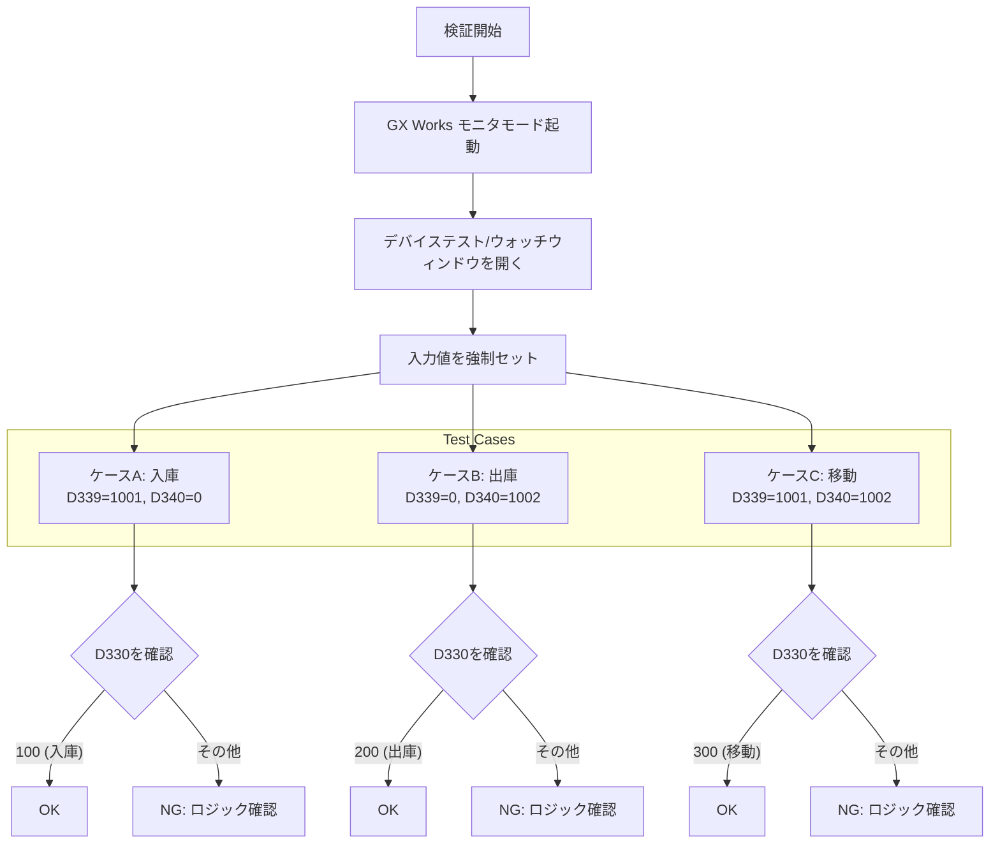
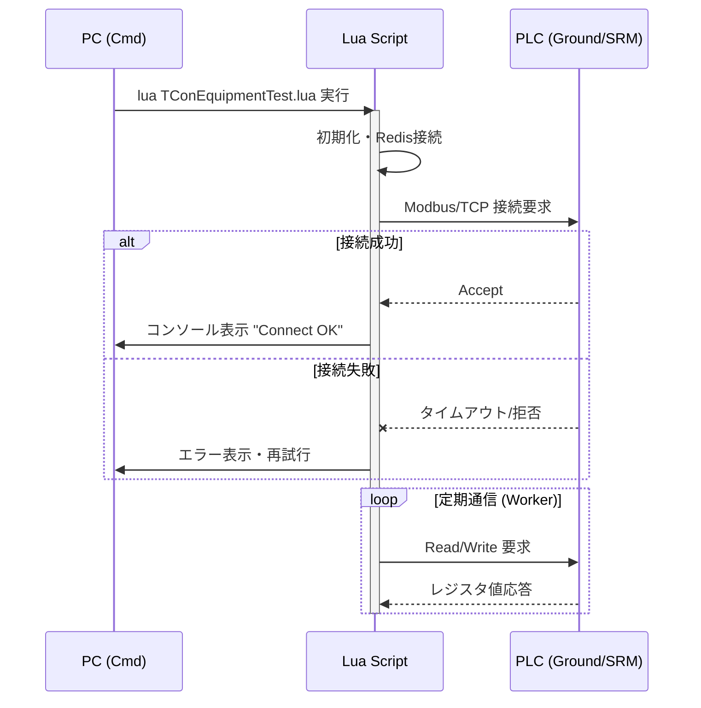
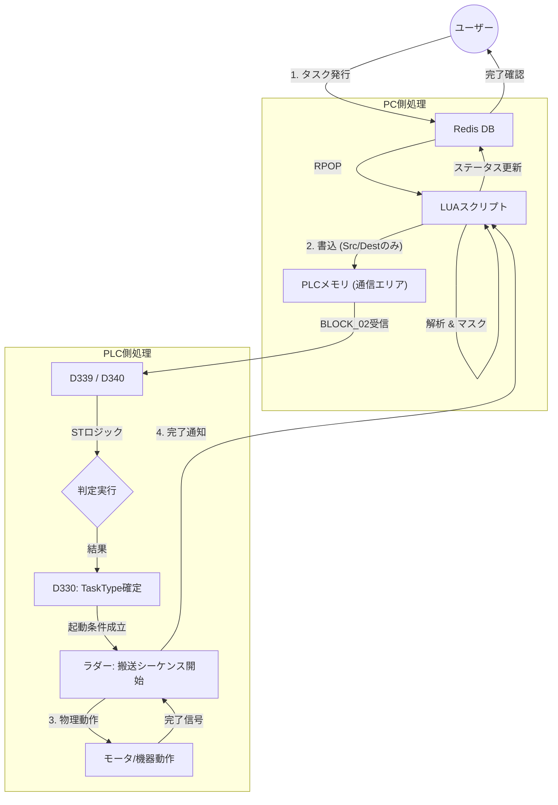

# デバッグ手順書

本手順書は、リファクタリングされたシステム（特にPLC側のSTロジック導入部分）の動作確認を行うためのものです。

## 1. 準備
1. **PC環境**: Windows端末にて必要なLUAスクリプト、Redisサーバーが動作していることを確認する。
2. **PLC環境**: GX Works2/3にて、`refact`フォルダ内のプログラム (`.asc`, `.st`) がPLCに書き込まれているか（シミュレータ含む）確認する。
3. **ネットワーク**: PCとPLCがEthernetで接続され、Pingが通ることを確認する。

## 2. タスク判定ロジック (ST言語) の確認
今回新たに追加された `Masked_ST_Logic.st` が正しく機能し、PCからの指示（TaskTypeなし）を補完できるか確認します。
以下に検証フローを示します。

### 判定条件テーブル
| ケース | 入力: D339 (Src) | 入力: D340 (Dest) | 期待値: D330 (TaskType) |
|---|---|---|---|
| A. 入庫 | 0より大 (例: 1001) | 0 | **100** |
| B. 出庫 | 0 | 0より大 (例: 1002) | **200** |
| C. 移動 | 0より大 (例: 1001) | 0より大 (例: 1002) | **300** |

*※ `Masked_ST_Logic.st` がラダーのスキャンタイム内で実行されている必要があります。*

## 3. Lua - PLC 通信確認
LUAスクリプトとPLC間の通信確立を確認します。

## 4. 統合動作確認
Redisへのタスク投入からPLCの実動作までの統合テストフローです。

### 確認手順
1. redis-cli 等でリスト `taskInfo` にJSON文字列を `LPUSH` する。
2. PLCの `D3009`, `D3010` に値が反映されるのを目視確認。
3. 自動的に `D330` が変化し、装置が動き出す（またはシミュレータ上で該当リレーが動く）ことを確認。
