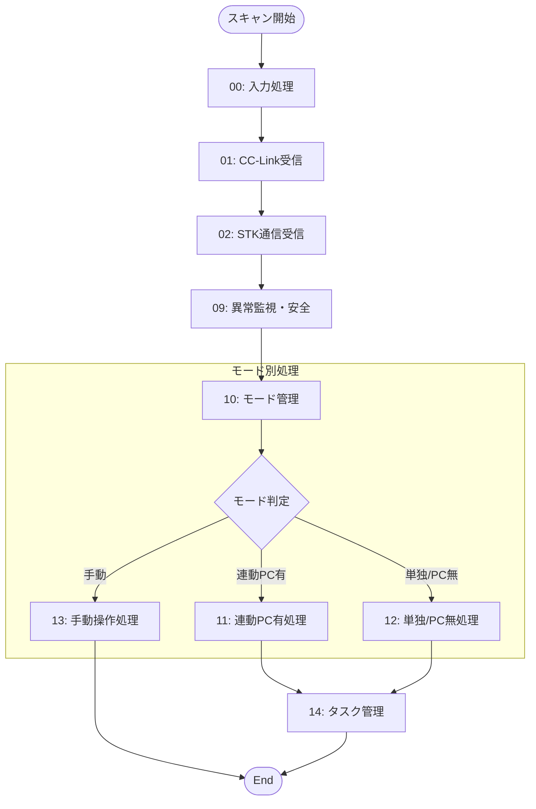
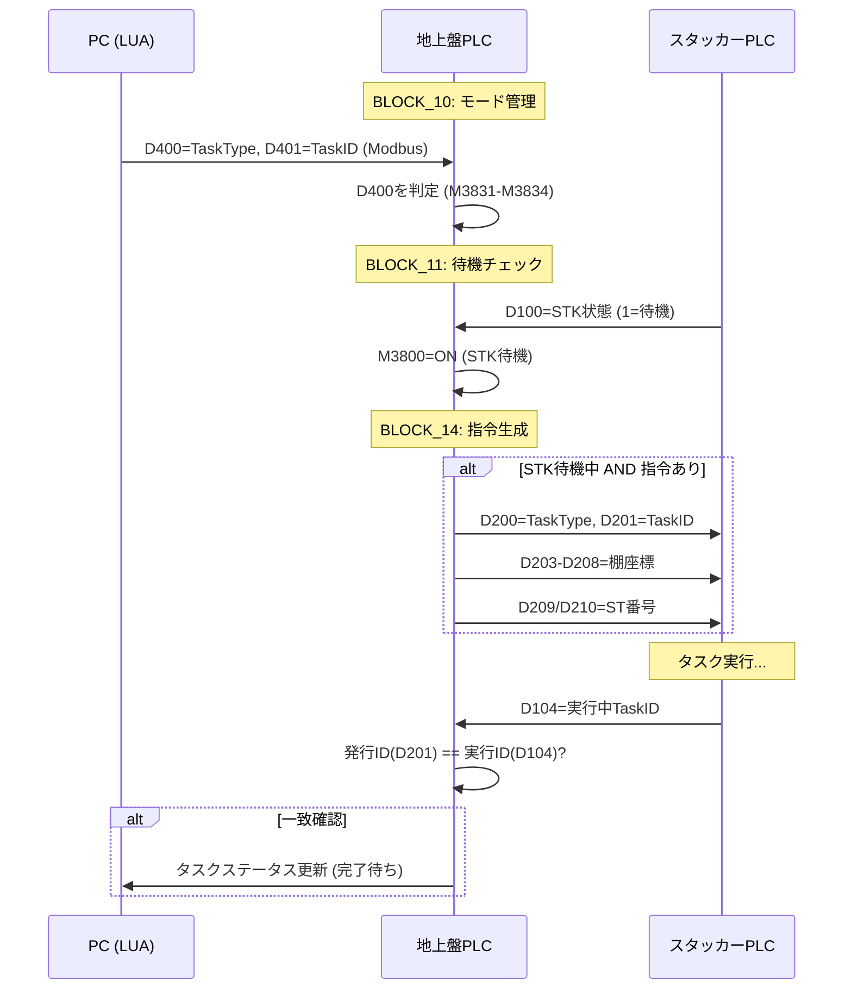
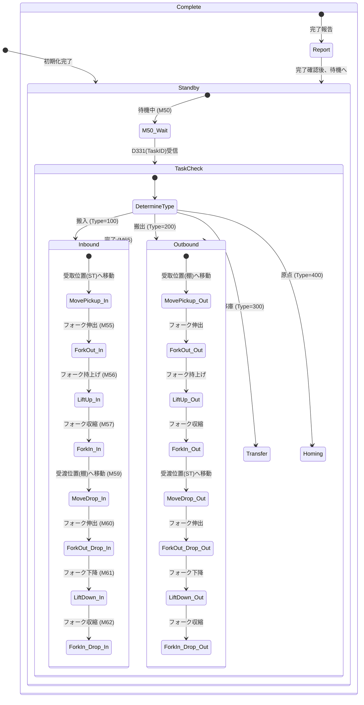
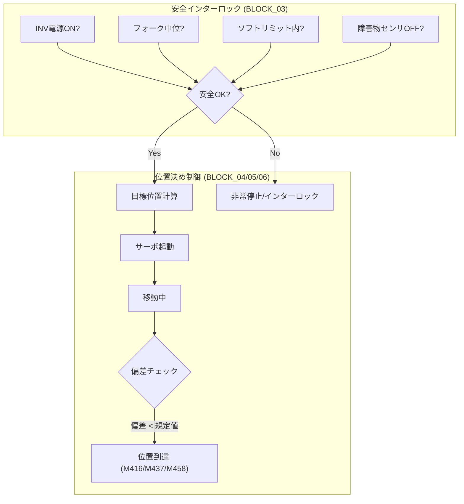
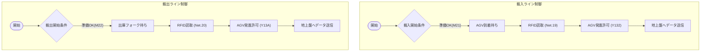

# PLCプログラム 制御フロー図

各PLCプログラム（地上盤、スタッカークレーン、コンベア）の制御ロジックを可視化したフロー図です。

## 1. 地上盤PLC (Ground Panel)
ファイル: `GroundPanel_Refactored_Q_GXW.asc`

### 1-1. メイン処理フロー
プログラムの全体構成と実行順序です。

### 1-2. タスク管理フロー (連動モード)
WMS/PCからの指示を受け、STKへタスクを発行するフローです。

## 2. スタッカークレーンPLC (Stacker Crane)
ファイル: `StackerCrane_Refactored_Q_GXW.asc`

### 2-1. 自動運転ステートマシン (BLOCK_07)
スタッカークレーンの自動運転ロジックの中心となるステートマシンです。

### 2-2. 軸制御・安全インターロック (BLOCK_03, 04)
物理的な軸動作と安全チェックのフローです。

## 3. コンベアPLC (Conveyor)
ファイル: `Conveyor_Refactored_Q_GXW.asc`

### 3-1. 搬入・搬出連携フロー
AGVおよび地上盤との連携ロジックです。

