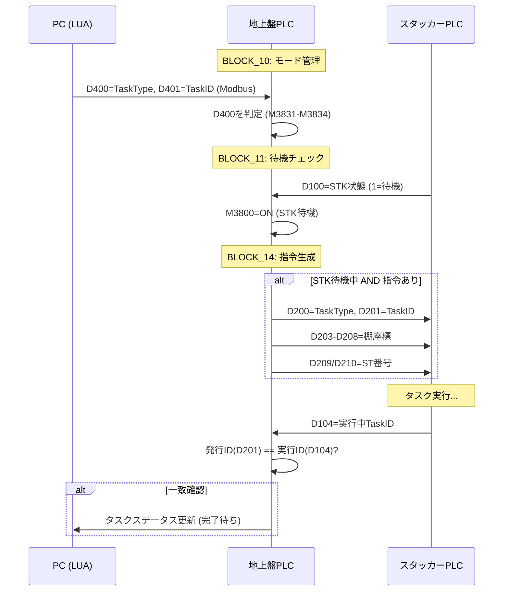
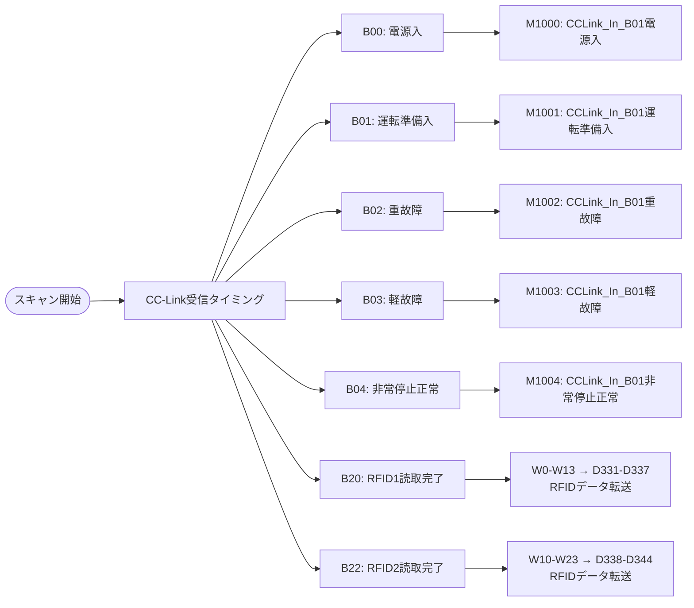
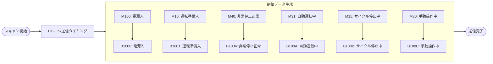
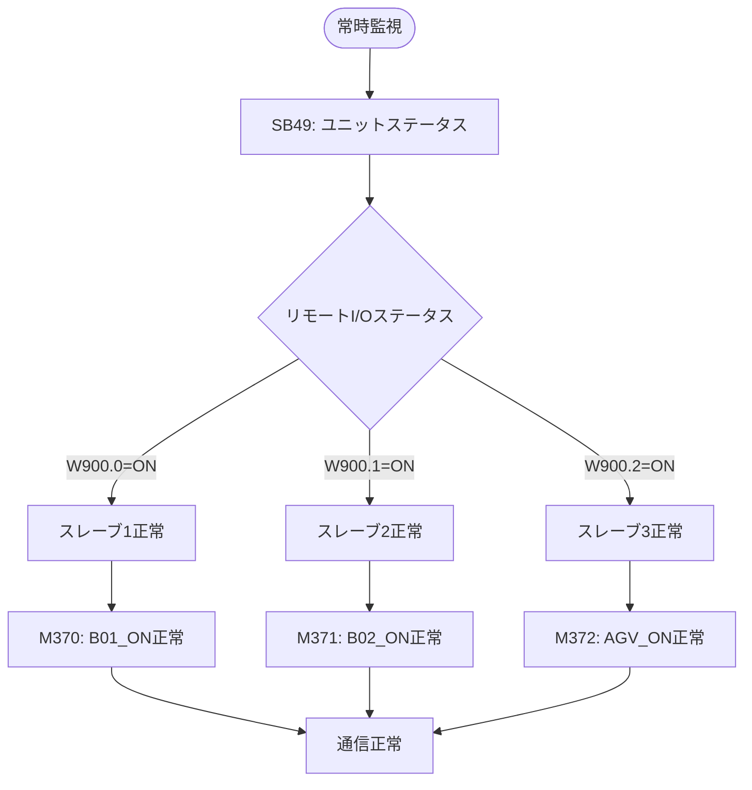
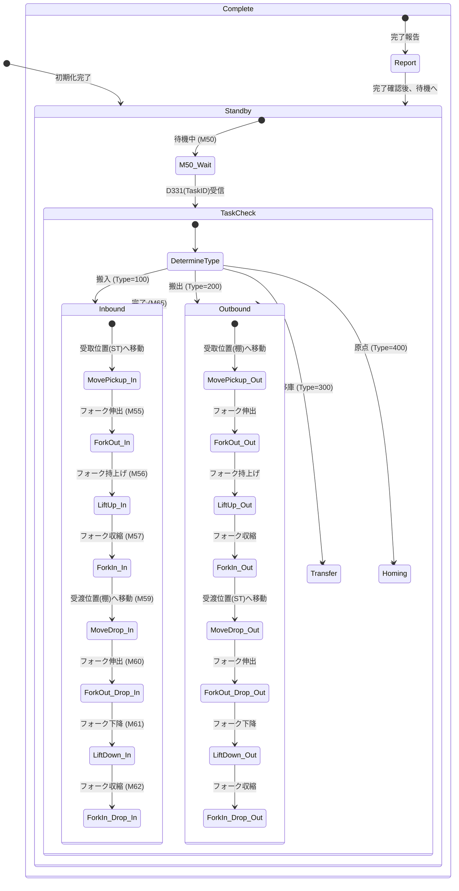
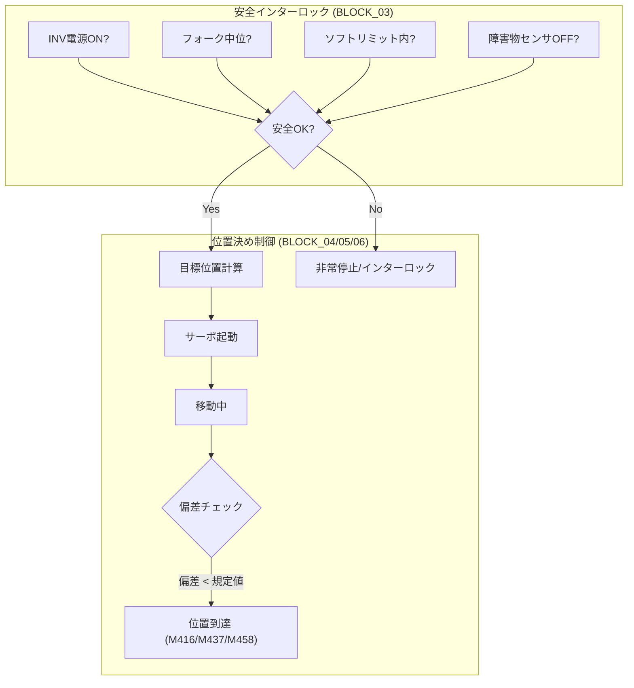
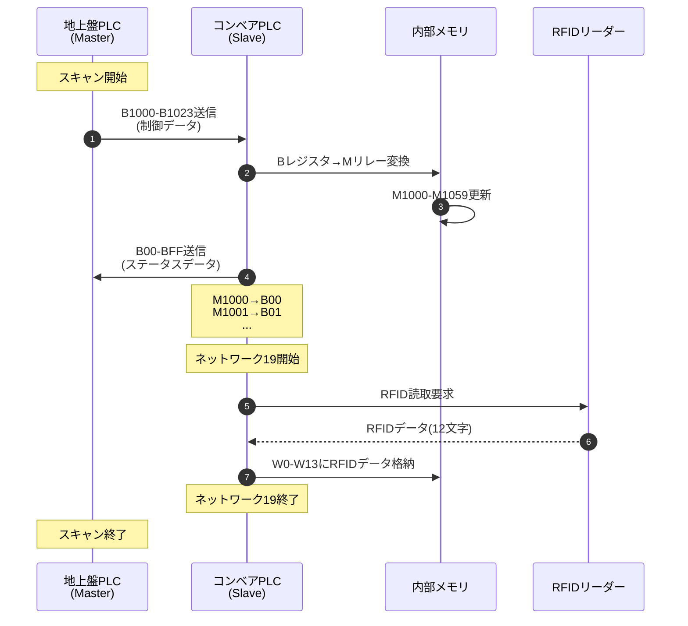
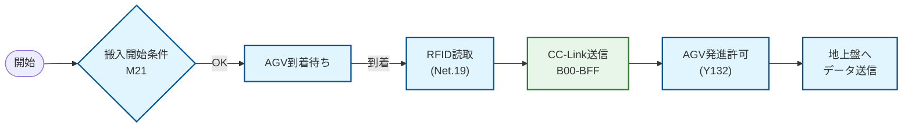
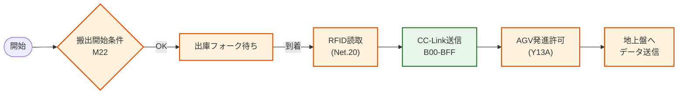

# PLCプログラム 制御フロー図

各PLCプログラム（地上盤、スタッカークレーン、コンベア）の制御ロジックを可視化したフロー図です。

## 1. 地上盤PLC (Ground Panel)
ファイル: `GroundPanel_Refactored_Q_GXW.asc`

### 1-1. メイン処理フロー
プログラムの全体構成と実行順序です。

### 1-2. タスク管理フロー (連動モード)
WMS/PCからの指示を受け、STKへタスクを発行するフローです。

## 2. 地上盤PLC (Ground Panel) - CC-Link通信詳細
ファイル: `GroundPanel_Refactored_Q_GXW.asc`

### 2-1. CC-Link受信処理フロー（プログラム01）

コンベアPLCからのステータス受信処理の詳細フローです。

### 2-2. CC-Link送信処理フロー（プログラム41）

コンベアPLCへの制御データ送信処理の詳細フローです。

### 2-3. CC-Link通信監視フロー（プログラム09）

CC-Link通信状態の監視処理フローです。

## 3. スタッカークレーンPLC (Stacker Crane)
ファイル: `StackerCrane_Refactored_Q_GXW.asc`

### 3-1. 自動運転ステートマシン (BLOCK_07)
スタッカークレーンの自動運転ロジックの中心となるステートマシンです。

### 2-2. 軸制御・安全インターロック (BLOCK_03, 04)
物理的な軸動作と安全チェックのフローです。

## 4. コンベアPLC (Conveyor)
ファイル: `Conveyor_Refactored_Q_GXW.asc`

### 4-1. CC-Link通信処理フロー

コンベアPLCと地上盤PLC間のCC-Link通信処理の詳細フローです。

### 4-2. CC-Link信号マッピング

**地上盤→コンベア（制御データ）:**

| バッファ | 内部リレー | 説明 |
|---------|-----------|------|
| B1000 | M1000 | 電源入 |
| B1001 | M1001 | 運転準備入 |
| B1004 | M1004 | 非常停止正常 |
| B100A | M1010 | 自動運転中 |
| B1010 | M1016 | 自動モード選択 |
| B101A | M1026 | 連動運転開始 |

**コンベア→地上盤（ステータスデータ）:**

| 内部リレー | バッファ | 説明 |
|-----------|---------|------|
| M1000 | B00 | 電源入 |
| M1001 | B01 | 運転準備入 |
| M1002 | B02 | 重故障 |
| M1004 | B04 | 非常停止正常 |
| M1048 | B30 | CV1_STK受取可 |
| M1049 | B31 | CV1_AGV発進可 |
| M1064 | B40 | CV2_STK受渡可 |
| M1065 | B41 | CV2_AGV発進可 |

### 4-3. 搬入ライン連携フロー (Input Line)
AGV到着から地上盤へのデータ連携までのフローです。

### 4-4. 搬出ライン連携フロー (Output Line)
出庫フォーク待ちから搬出完了までのフローです。

