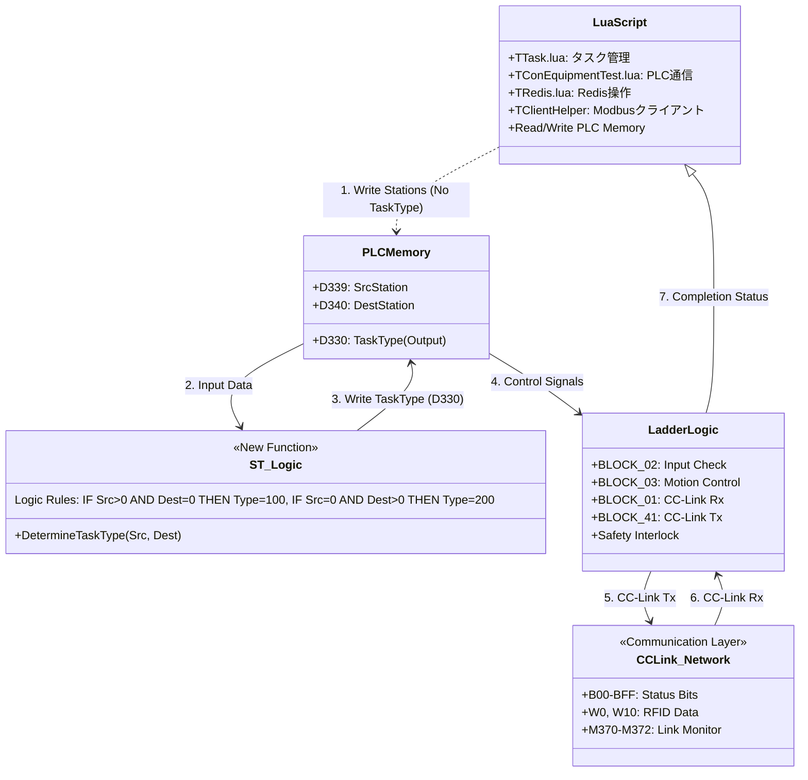
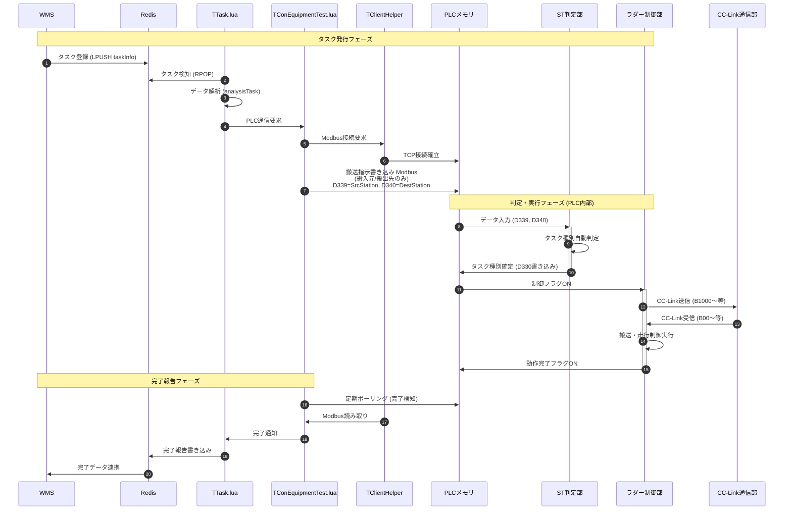

# システムアーキテクチャ・ソフトウェア構成

## 1. ハードウェア & ネットワーク構成
物理的な機器の接続構成です。PCを中心に、Modbus/TCPとCC-Linkの2つのネットワークで構成されています。

```mermaid
graph TB
    subgraph Host ["上位層"]
        WMS["WMS Server<br/>倉庫管理システム"]
    end

    subgraph PC_Layer ["制御PC層 (Windows)"]
        style PC_Layer fill:#f9f,stroke:#333
        CtrlPC["制御PC"]

        subgraph PC_Internal ["PC内部ソフトウェア"]
            style PC_Internal fill:#fff,stroke:#666
            Redis["Redis DB"]
            LuaApp["Lua制御アプリ<br/>TTask.lua, TConEquipmentTest.lua"]
        end
    end

    subgraph PLC_Layer ["PLC制御層"]
        style PLC_Layer fill:#eef,stroke:#333

        GP_PLC["地上盤 PLC<br/>Q Series"]
        SRM_PLC["スタッカー PLC<br/>SRM"]
        CV_PLC["コンベア PLC<br/>CV"]
    end

    subgraph Device_Layer ["フィールド機器層"]
        AGV["無人搬送車 AGV"]
        SRM_HW[クレーン モータ/センサ]
        CV_HW[コンベア モータ/センサ]
    end

    %% Network Connections
    WMS <==>|"Task I/F"| Redis
    Redis <==>|"Localhost"| LuaApp

    LuaApp == Modbus/TCP ==> GP_PLC
    LuaApp == Modbus/TCP ==> SRM_PLC
    LuaApp == Modbus/TCP ==> CV_PLC
    note1["※ Modbus/TCP通信は TConEquipmentTest.lua<br/>および TClientHelper により実装"]
    LuaApp -. note1

    GP_PLC == CC-Link ==> SRM_PLC
    GP_PLC == CC-Link ==> CV_PLC
    note2["※ CC-Linkは三菱電機の<br/>オープンネットワーク"]
    GP_PLC -. note2

    %% Field Connections
    GP_PLC -. Wireless .-> AGV
    SRM_PLC --- SRM_HW
    CV_PLC --- CV_HW
```

### 1.1 Modbus/TCP通信詳細

PCのLuaアプリケーションとPLC間の通信はModbus/TCPプロトコルで行われます。

| 項目 | 設定値 |
|------|--------|
| プロトコル | Modbus/TCP |
| 実装ファイル | `TConEquipmentTest.lua`, `TClientHelper` |
| ポート番号 | 502 (デフォルト) |
| 通信機能 | レジスタ読み書き、接続監視 |

**主な通信処理:**
- PLCレジスタの読み取り（機能コード: 0x03）
- PLCレジスタの書き込み（機能コード: 0x06, 0x10）
- 接続チェック（`checkConnect()`）

### 1.2 CC-Link通信詳細

地上盤PLCをマスターとし、スタッカーPLCとコンベアPLCをスレーブとするCC-Linkネットワークを構成します。

| 項目 | 設定値 |
|------|--------|
| プロトコル | CC-Link (三菱電機) |
| マスター局 | 地上盤 PLC |
| スレーブ局 | スタッカー PLC, コンベア PLC |
| 通信方式 | 循環伝送 |

**主な信号マッピング:**

| 送信元 | 送信先 | レジスタ/ビット | 内容 |
|--------|--------|-----------------|------|
| 地上盤 | コンベア | B1000-B1023 | B01制御データ送信 |
| 地上盤 | コンベア | B1100-B1123 | B02制御データ送信 |
| コンベア | 地上盤 | B00-BFF | B01/B02設備状態ビット受信 |
| 地上盤 | スタッカー | U2\G4096, U2\G12288 | 自動データ送受信 |

## 2. ソフトウェアモジュール関連図
リファクタリング後のソフトウェアコンポーネント間のデータの流れを示します。今回の改修でPLC内部にロジックが一部移管されました。



## 3. 詳細ワークフロー (シーケンス)
タスク発生から完了までの時系列フロー詳細です。



## 4. プログラムファイル構成

### 4.1 Luaプログラムファイル

| ファイル名 | 役割 | 主な機能 |
|-----------|------|---------|
| `TTask.lua` | タスク管理メタクラス | WMSからのタスク受信、解析、Redis連携、SQL操作 |
| `TConEquipmentTest.lua` | PLC通信クラス | Modbus/TCP通信、PLCレジスタ読み書き、接続監視 |
| `TRedis.lua` | Redis操作クラス | hmget/hmset、lpush/rpop、接続プール管理 |

### 4.2 PLCプログラムファイル

| ファイル名 | 役割 | 主な機能 |
|-----------|------|---------|
| `GroundPanel_Refactored_Q_GXW.asc` | 地上盤PLCプログラム | CC-Link通信、タスク管理、モード選択、HMI処理 |
| `StackerCrane_Refactored_Q_GXW.asc` | スタッカークレーンPLC | 軸制御、自動運転、安全監視、座標テーブル |
| `Conveyor_Refactored_Q_GXW.asc` | コンベアPLCプログラム | CC-Link通信、RFID処理、AGV連携 |
| `Masked_ST_Logic.st` | STロジック（タスク判定） | D339/D340からD330を判定 |

## 5. 通信プロトコル詳細

### 5.1 Modbus/TCP通信仕様

**接続先一覧:**

| PLC | IPアドレス | ポート | 用途 |
|-----|-----------|--------|------|
| 地上盤 PLC | 192.168.1.1 | 502 | タスク指示、ステータス監視 |
| スタッカー PLC | 192.168.1.2 | 502 | 走行/昇降/フォーク制御 |
| コンベア PLC | 192.168.1.3 | 502 | 搬入/搬出制御 |

**主なレジスタマップ:**

| レジスタ | アドレス | 内容 |
|---------|---------|------|
| D3000 | 3000 | システムハートビート |
| D3002 | 3002 | 設備状態 |
| D3009 | 3009 | 搬入台番号/ST番号 |
| D3010 | 3010 | 搬出台番号/ST番号 |
| D330 | 330 | タスク種別（出力） |
| D339 | 339 | 搬入元ステーション（入力） |
| D340 | 340 | 搬出先ステーション（入力） |

### 5.2 CC-Link通信仕様

**バッファメモリマップ（地上盤↔コンベア）:**

| 方向 | バッファ | 内容 | 詳細 |
|------|---------|------|------|
| Rx | B00-BFF | B01/B02設備状態 | 電源、運転準備、異常、モード選択等 |
| Rx | W0-W13 | RFIDデータ | 12文字のRFIDコード |
| Tx | B1000-B1023 | B01制御データ | 運転許可、モード、タスク送信 |
| Tx | B1100-B1123 | B02制御データ | 運転許可、モード、タスク送信 |

**通信監視:**

| デバイス | 内容 |
|---------|------|
| M370 | B01_ON正常（W900.0） |
| M371 | B02_ON正常（W900.1） |
| M372 | AGV_ON正常（W900.2） |
| SB49 | ユニットステータス |
