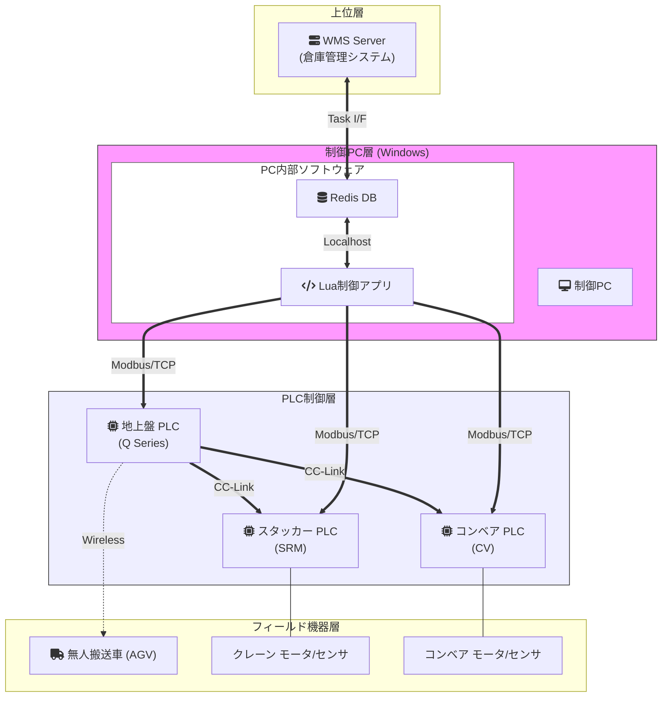
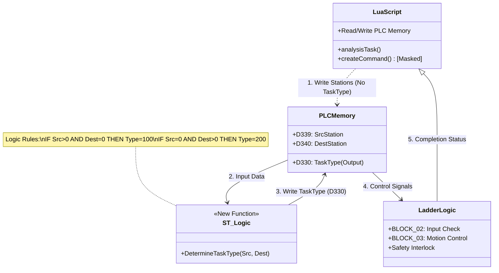
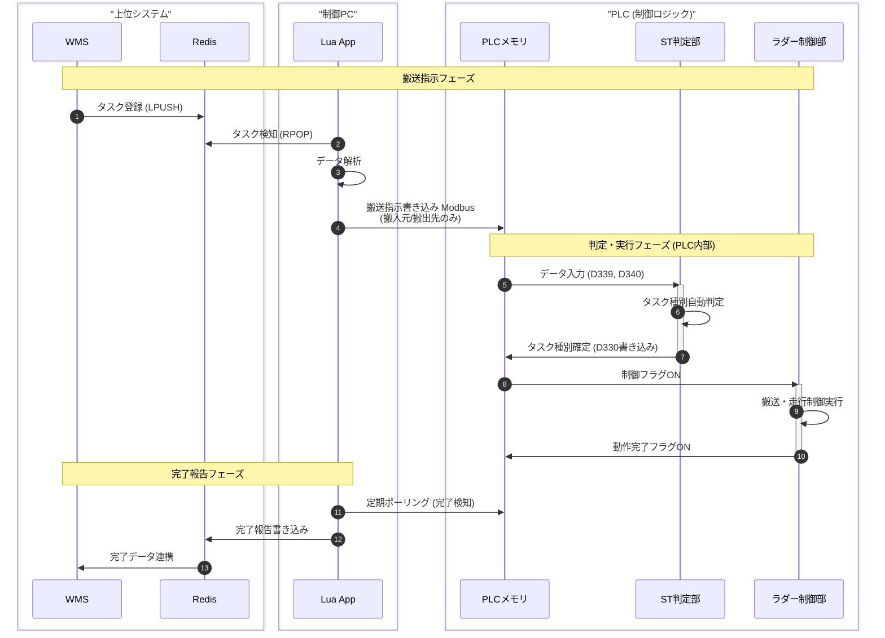

# システムアーキテクチャ・ソフトウェア構成

## 1. ハードウェア & ネットワーク構成
物理的な機器の接続構成です。PCを中心に、Modbus/TCPとCC-Linkの2つのネットワークで構成されています。

## 2. ソフトウェアモジュール関連図
リファクタリング後のソフトウェアコンポーネント間のデータの流れを示します。今回の改修でPLC内部にロジックが一部移管されました。

## 3. 詳細ワークフロー (シーケンス)
タスク発生から完了までの時系列フロー詳細です。

